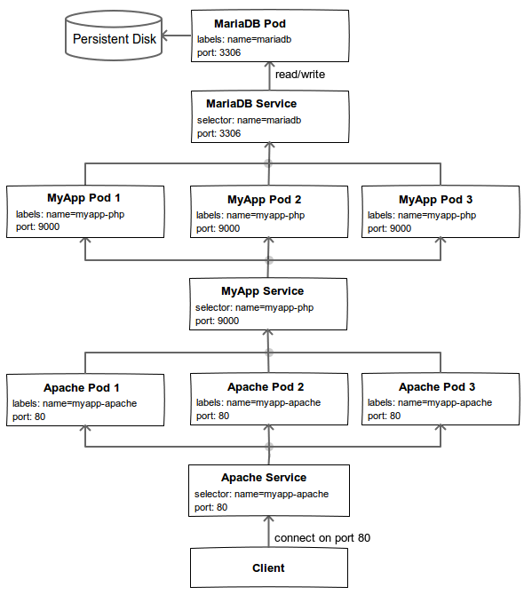
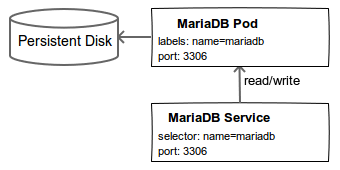
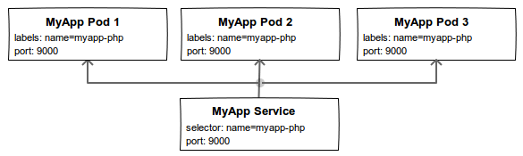
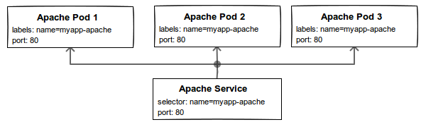

# Deploying PHP apps Using Bitnami Containers, Kubernetes and Google Cloud Platform

- [Prerequisites](#prerequisites)
  + [Container engine environment](#container-engine-environment)
- [Download the configuration files](#download-the-configuration-files)
- [Create the Docker container images](#create-the-docker-container-images)
    - [MyApp Image](#myapp-image)
    - [Apache Image](#apache-image)
- [Create your cluster](#create-your-cluster)
- [MariaDB](#mariadb)
  + [Create persistent disk](#create-persistent-disk)
  + [MariaDB pod and service](#mariadb-pod-and-service)
- [MyApp](#myapp)
  + [MyApp secret store](#myapp-secret-store)
  + [MyApp pod and service](#myapp-pod-and-service)
- [Apache](#apache)
  + [Apache pod and service](#apache-pod-and-service)
- [Allow external traffic](#allow-external-traffic)
- [Access your MyApp server](#access-your-myapp-server)
- [Scaling MyApp](#scaling-myapp)
- [Take down and restart MyApp](#take-down-and-restart-myapp)
- [Cleanup](#cleanup)

This tutorial walks you through deploying your PHP apps on a [Kubernetes](http://kubernetes.io) cluster deployed on the [Google Container Engine](https://cloud.google.com/container-engine/) using the [Bitnami Container Images](https://bitnami.com/docker) for [Docker](https://www.docker.com/). We also demostrate how you can scale individual components of the deployment to meet the traffic requirements.

We'll refer to our application as **MyApp**. The following illustration provides an overview of the architecture we'll setup using Kubernetes and Bitnami container images for our deployment.



We'll be creating a scalable deployment backed by an instance of the MariaDB container. We'll attach a persistent disk to the MariaDB instance so that it can preserve its state across shutdown and startup. Three replicas of the Apache container will act as the frontend to our PHP application. For high availability our MyApp application will be configured to also have three replicas. We also configure load balancing, external IP, a secret store and health checks.

## Prerequisites

### Container engine environment

Set up your Google Container Engine environment using [these instructions](https://cloud.google.com/container-engine/docs/before-you-begin).

## Download the configuration files

Clone the [bitnami-docker](https://github.com/bitnami/bitnami-docker) GitHub repository. The files used in this tutorial can be found in the `gke/lamp` directory of the cloned repository:

```bash
$ git clone https://github.com/bitnami/bitnami-docker.git
$ cd bitnami-docker/gke/lamp
```

## Create the Docker container images

In this section we'll build the Docker images for our deployment.

### MyApp image

The MyApp image is built using the `Dockerfile` from the `dockerfiles/myapp-php` directory. Docker container images can extend from other existing images. Since MyApp is a PHP application, we'll extend from the [bitnami/php-fpm](https://hub.docker.com/r/bitnami/php-fpm/) image.

Our sample application stores the visitor count in the MariaDB database. When we visit the page, the visitor count is updated and the new value is displayed on the page. On database connection errors, an error message is displayed. The application source can be found in the `code/` directory.

In the `Dockerfile` the application source is copied into the `/app` directory of the container. The base `bitnami/php-fpm` image uses [s6-overlay](https://github.com/just-containers/s6-overlay) for process supervision. We use the infrastucture provided by s6-overlay to create a container initialization script `/etc/cont-init.d/60-myapp` which configures the database connection parameters for our application in `/app/db-config.php`.

> **Note**: Our sample application does not allow users to upload files. If your PHP application allows users to upload files then you should make use of a cloud storage service such as [Amazon S3](http://aws.amazon.com/s3/) or [Google Cloud Storage](https://cloud.google.com/storage/) for persistence and so that the instance can be scaled horizontally which is not possible when persistent volumes are used.

Build the image by running:

```bash
$ cd dockerfiles/myapp-php/
$ docker build -t gcr.io/<google-project-name>/myapp-php .
```

Then push this image to the Google Container Registry:

```bash
$ gcloud docker push gcr.io/<google-project-name>/myapp-php
```

### Apache image

The Apache image is built using the `Dockerfile` from the `dockerfiles/myapp-apache` directory and it extends the [bitnami/apache](https://hub.docker.com/r/bitnami/apache/) image.

Apache serves as the frontend to our application and handles client HTTP requests while delegating the PHP processing to the `PHP-FPM` daemon of the MyApp container instances.

The MyApp application source is also copied into the Apache image at `/app` so that the static site assets are locally available and ready to be served by the Apache server.

Like the MyApp image, we use a container initialization script `/etc/cont-init.d/60-myapp` to create a catch-all virtual host configuration with `/app` as the [DocumentRoot](https://httpd.apache.org/docs/2.4/mod/core.html#documentroot) and the MyApp instances as the PHP processing backends.

Build the image by running:

```bash
$ cd dockerfiles/myapp-apache/
$ docker build -t gcr.io/<google-project-name>/myapp-apache .
```

Then push this image to the Google Container Registry:

```bash
$ gcloud docker push gcr.io/<google-project-name>/myapp-apache
```

## Create your cluster

Now you are ready to create the Kubernetes cluster on which you'll run the MyApp deployment. A cluster consists of a master API server hosted by Google and a set of worker nodes.

Create a cluster named `myapp`:

```bash
$ gcloud beta container clusters create myapp
```

A successful create response looks like:

```
Creating cluster myapp...done.
Created [.../projects/bitnami-tutorials/zones/us-central1-b/clusters/myapp].
kubeconfig entry generated for myapp.
NAME   ZONE           MASTER_VERSION  MASTER_IP     MACHINE_TYPE   STATUS
myapp  us-central1-b  1.0.6           104.154.70.1  n1-standard-1  RUNNING
```

Now that your cluster is up and running, we are set to launch the components that make up our deployment.

## MariaDB



The above diagram illustrates our MariaDB backend. We'll create a single MariaDB instance with a persistent disk attached to it which will allow the database server to preserve its state across startup and shutdown.

### Create persistent disk

We'll make use of [volumes](http://kubernetes.io/v1.0/docs/user-guide/volumes.html) to create a persistent disk for the MariaDB server. This volume is used in the pod definition of the MariaDB controller.

Create the persistent disk using:

```bash
$ gcloud compute disks create --size 200GB mariadb-disk
Created [.../projects/bitnami-tutorials/zones/us-central1-b/disks/mariadb-disk].
NAME         ZONE          SIZE_GB TYPE        STATUS
mariadb-disk us-central1-b 200     pd-standard READY
```

### MariaDB pod and service

The first thing that we're going to do is start a [pod](http://kubernetes.io/v1.0/docs/user-guide/pods.html) for MariaDB. We'll use a [replication controller](http://kubernetes.io/v1.0/docs/user-guide/replication-controller.html) to create the pod — even though it's a single pod, the controller is still useful for monitoring health and restarting the pod if required.

We'll use the config file `mariadb-controller.yml` for the pod which creates a single MariaDB pod with the label `name=mariadb`. The pod uses the [bitnami/mariadb](https://hub.docker.com/r/bitnami/mariadb/) image and specifies the user and database to create using environment variables.

> **Note**:
>
> You can change the value of the `MARIADB_PASSWORD` env variable to your choosing.

To create the pod:

```bash
$ kubectl create -f mariadb-controller.yml
```

Check to see if the pod is running. It may take a minute to change from `Pending` to `Running`:

```bash
$ kubectl get pods -l name=mariadb
NAME            READY     STATUS    RESTARTS   AGE
mariadb-hy5cc   1/1       Running   0          22s
```

A [service](http://kubernetes.io/v1.0/docs/user-guide/services.html) is an abstraction which defines a logical set of pods and a policy by which to access them. It is effectively a named load balancer that proxies traffic to one or more pods.

When you set up a service, you tell it the pods to proxy based on pod labels. The pod that you created in previous step has the label `name=mariadb`.

We'll use the file `mariadb-service.yml` to create a service for MariaDB. The `selector` field of the service configuration determines which pods will receive the traffic sent to the service. So, the configuration specifies that we want this service to point to pods labeled with `name=mariadb`.

Start the service:

```bash
$ kubectl create -f mariadb-service.yml
```

See it running:

```bash
$ kubectl get services mariadb
NAME      LABELS         SELECTOR       IP(S)            PORT(S)
mariadb   name=mariadb   name=mariadb   10.115.241.186   3306/TCP
```

## MyApp

Now that we have our database backend up and running, lets set up our MyApp application instance.



The above diagram illustrates the MyApp pod and service configuration.

### MyApp secret store

A [secret key store](http://kubernetes.io/v1.0/docs/user-guide/secrets.html) is intended to hold sensitive information such as passwords, access keys, etc. Having this information in a key store is safer and more flexible than putting it in to the pod definition.

We'll create a key store to save the sensitive configuration parameters of our deployment. This includes, but is not limited to the database password.

Begin by encoding our database password in base64.

```bash
$ base64 -w128 <<< "secretpassword"
c2VjcmV0cGFzc3dvcmQK
```

Update `myapp-secrets.yml` with the `base64` encoded database password and create the secret key store using:

```bash
$ kubectl create -f myapp-secrets.yml
```

See it running:

```bash
$ kubectl get secrets -l name=myapp-secrets
NAME            TYPE      DATA
myapp-secrets   Opaque    1
```

This secret key store will be mounted at `/etc/secrets` in read-only mode in the MyApp pods.

### MyApp pod and service

The controller and its pod template is described in the file `myapp-controller.yml`. It specifies 3 replicas of the pod with the label `name=myapp-php`.

> **Note**:
>
> Change the image name to `gcr.io/<google-project-name>/myapp-php` as per the build instructions in [MyApp image](#myapp-image).

Using this file, you can start your MyApp controller with:

```bash
$ kubectl create -f myapp-controller.yml
```

Check to see if the pods are running. It may take a few minutes to change from `Pending` to `Running`:

```bash
$ kubectl get pods -l name=myapp-php
NAME              READY     STATUS    RESTARTS   AGE
myapp-php-05mvy   1/1       Running   0          12s
myapp-php-0ftsv   1/1       Running   0          12s
myapp-php-3tax6   1/1       Running   0          12s
```

We want a service to group the MyApp pods. The service specification for the MyApp service is defined in `myapp-service.yml` and specifies the label `name=myapp-php` as the pod `selector`.

Start the service using:

```bash
$ kubectl create -f myapp-service.yml
```

See it running:

```bash
$ kubectl get services myapp-php
NAME        LABELS           SELECTOR         IP(S)           PORT(S)
myapp-php   name=myapp-php   name=myapp-php   10.115.243.56   9000/TCP
```

## Apache

Now that we have the MariaDB and MyApp pods running, lets set up the Apache pods and service which will act as the frontend to our deployment.



The above diagram illustrates the Apache pod and service configuration.

### Apache pod and service

The controller and its pod template is described in the file `apache-controller.yml`. It specifies 3 replicas of the server with the label `name=myapp-apache`.

> **Note**
>
> 1. Change the image name to `gcr.io/<google-project-name>/myapp-apache` as per the build instructions in [Apache image](#apache-image).

Using this file, you can start the Apache controller with:

```bash
$ kubectl create -f apache-controller.yml
```

Check to see if the pods are running:

```bash
$ kubectl get pods -l name=myapp-apache
NAME                 READY     STATUS    RESTARTS   AGE
myapp-apache-0dath   1/1       Running   0          11s
myapp-apache-bu7dt   1/1       Running   0          11s
myapp-apache-eb6mo   1/1       Running   0          11s
```

Once the servers are up, you can list the pods in the cluster, to verify that they're all running:

```bash
$ kubectl get pods
NAME                 READY     STATUS    RESTARTS   AGE
mariadb-hy5cc        1/1       Running   0          3m
myapp-apache-0dath   1/1       Running   0          1m
myapp-apache-bu7dt   1/1       Running   0          1m
myapp-apache-eb6mo   1/1       Running   0          1m
myapp-php-05mvy      1/1       Running   0          2m
myapp-php-0ftsv      1/1       Running   0          2m
myapp-php-3tax6      1/1       Running   0          2m
```

You'll see a single MariaDB pod, three MyApp pods and three Apache pods. In [Scaling MyApp](#scaling-myapp) we'll see how we can scale the MyApp and Apache pods on demand.

As with the other pods, we want a service to group the Apache pods. However, this time it's different: this service is user-facing, so we want it to be externally visible. That is, we want a client to be able to request the service from outside the cluster. To accomplish this, we can set the `type: LoadBalancer` field in the service configuration.

The service specification `apache-service.yml` specifies the label `name=myapp-apache` as the pod `selector`.

```bash
$ kubectl create -f apache-service.yml
```

See it running:

```bash
$ kubectl get services myapp-apache
NAME           LABELS              SELECTOR            IP(S)           PORT(S)
myapp-apache   name=myapp-apache   name=myapp-apache   10.115.240.76   80/TCP
```

## Allow external traffic

By default, the pod is only accessible by its internal IP within the cluster. In order to make the Apache service accessible from the internet we have to open the TCP port `80`.

First we need to get the node prefix for the cluster using:

```bash
$ kubectl get nodes
NAME                           LABELS                                                STATUS
gke-myapp-20af8802-node-6jgn   kubernetes.io/hostname=gke-myapp-20af8802-node-6jgn   Ready
gke-myapp-20af8802-node-e52t   kubernetes.io/hostname=gke-myapp-20af8802-node-e52t   Ready
gke-myapp-20af8802-node-rs35   kubernetes.io/hostname=gke-myapp-20af8802-node-rs35   Ready
```

The value of `--target-tag` in the command below is the node prefix for the cluster up to `-node`.

```bash
$ gcloud compute firewall-rules create --allow=tcp:80 \
    --target-tags=gke-myapp-20af8802-node myapp-http
```

A successful response looks like:

```bash
Created [.../projects/bitnami-tutorials/global/firewalls/myapp-http].
NAME       NETWORK SRC_RANGES RULES  SRC_TAGS TARGET_TAGS
myapp-http default 0.0.0.0/0  tcp:80          gke-myapp-20af8802-node
```

Alternatively, you can open up port `80` from the [Developers Console](https://console.developers.google.com/).

## Access your MyApp server

Now that the firewall is open, you can access the service over the internet. Find the external IP of the Apache service you just set up using:

```bash
$ kubectl describe services myapp-apache
Name:                   myapp-apache
Namespace:              default
Labels:                 name=myapp-apache
Selector:               name=myapp-apache
Type:                   LoadBalancer
IP:                     10.115.240.76
LoadBalancer Ingress:   104.197.145.8
Port:                   <unnamed> 80/TCP
NodePort:               <unnamed> 30638/TCP
Endpoints:              10.112.0.6:80,10.112.0.7:80,10.112.1.6:80
Session Affinity:       None
No events.
```

Visit `http://x.x.x.x` in your favourite web browser, where `x.x.x.x` is the IP address listed next to `LoadBalancer Ingress` in the response of the above command.

We now have a scalable deployment of our MyApp application. The next section demonstrates how the deployment can be scaled without any downtime.

## Scaling MyApp

Since the MyApp and Apache pods are defined as services that use a replication controller, you can easily resize the number of pods in the replication controller as follows:

To scale the MyApp pods:

```bash
$ kubectl scale --replicas=5 rc myapp-php
```

The configuration for the controllers will be updated, to specify that there should be 5 replicas running. The replication controller adjusts the number of pods it is running to match that, and you will be able to see the additional pods running:

```bash
$ kubectl get pods -l name=myapp-php
NAME              READY     STATUS    RESTARTS   AGE
myapp-php-0bumv   1/1       Running   0          1m
myapp-php-cdp58   1/1       Running   0          1m
myapp-php-es3wz   1/1       Running   0          1m
myapp-php-rdlsh   1/1       Running   0          10s
myapp-php-t9b4p   1/1       Running   0          10s
```

Similarly to scale the Apache pods:

```bash
$ kubectl scale --replicas=5 rc myapp-apache
```

You can scale down in the same manner.

> **Note**: Even though the MariaDB pod uses a replication controller, it cannot be scaled in our configuration.

## Take down and restart MyApp

Because we used a persistent disk for the MariaDB master pod, the state of your MyApp deployment is preserved even when the pods it's running on are deleted. Lets try it.

```bash
$ kubectl delete rc myapp-apache
$ kubectl delete rc myapp-php
$ kubectl delete rc mariadb
```

*Deleting the replication controller also deletes its pods.*

Confirm that the pods have been deleted:

```bash
$ kubectl get pods
```

Then re-create the pods:

```bash
$ kubectl create -f mariadb-controller.yml
$ kubectl create -f myapp-controller.yml
$ kubectl create -f apache-controller.yml
```

Once the pods have restarted, the `mariadb`, `myapp-php` and `myapp-apache` services pick them up immediately based on their labels, and your deployment is restored.

## Cleanup

To delete your application completely:

*If you intend to teardown the entire cluster, jump to __Step 4__.*

  1. Delete the controllers:

  ```bash
  $ kubectl delete rc myapp-apache
  $ kubectl delete rc myapp-php
  $ kubectl delete rc mariadb
  ```

  2. Delete the services:

  ```bash
  $ kubectl delete service myapp-apache
  $ kubectl delete service myapp-php
  $ kubectl delete service mariadb
  ```

  3. Delete the secret key store

  ```bash
  $ kubectl delete secret myapp-secrets
  ```

  4. Delete your cluster:

  ```bash
  $ gcloud beta container clusters delete myapp
  ```

  5. Delete the firewall rule:

  ```bash
  $ gcloud compute firewall-rules delete myapp-http
  ```

  6. Delete the disks:

  ```bash
  $ gcloud compute disks delete mariadb-disk
  ```
