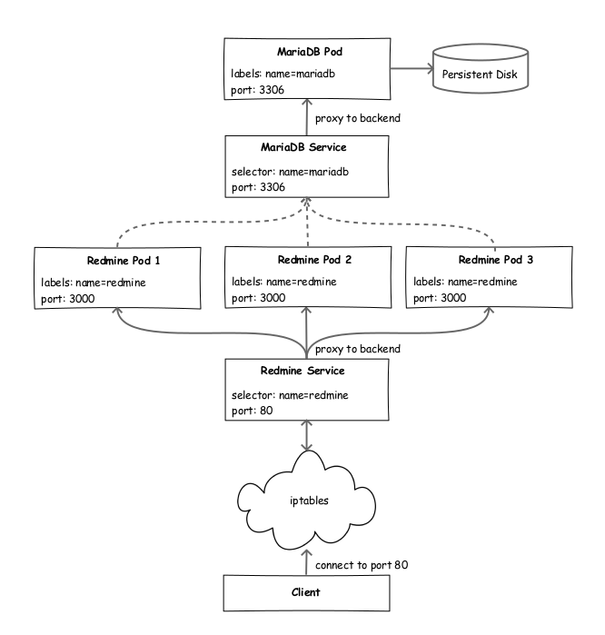
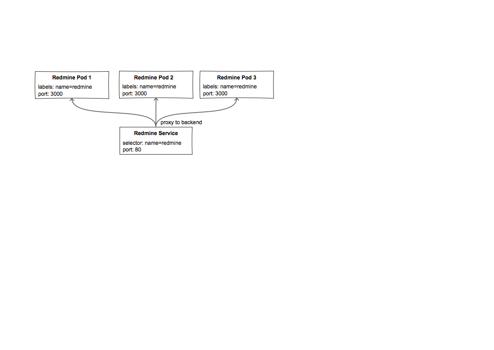
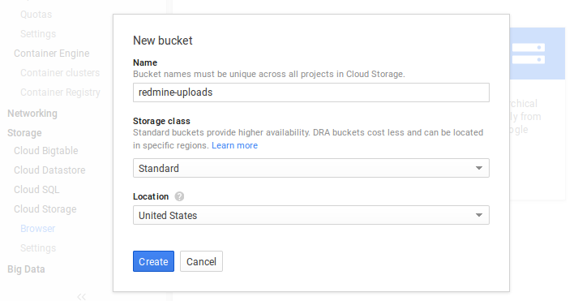

# Scalable Redmine Using Bitnami Containers, Kubernetes and Google Cloud Platform

- [Prerequisites](#prerequisites)
  + [Container engine environment](#container-engine-environment)
  + [Download the configuration files](#download-the-configuration-files)
- [Create a Docker container image](#create-a-docker-container-image)
- [Create your cluster](#create-your-cluster)
- [MariaDB](#mariadb)
  + [Create persistent disk](#create-persistent-disk)
  + [MariaDB master pod and service](#mariadb-master-pod-and-service)
  + [MariaDB slave pod and service](#mariadb-slave-pod-and-service)
- [Redmine](#redmine)
  + [Create Google cloud storage bucket](#create-google-cloud-storage-bucket)
  + [Redmine secret store](#redmine-secret-store)
  + [Redmine pod and service](#redmine-pod-and-service)
- [Allow external traffic](#allow-external-traffic)
- [Access your Redmine server](#access-your-redmine-server)
- [Scaling the Redmine application](#scaling-the-redmine-application)
- [Take down and restart Redmine](#take-down-and-restart-redmine)
- [Cleanup](#cleanup)

This tutorial walks through setting up a scalable [Redmine](http://redmine.org) installation on Google Container Engine using the Bitnami Container Images for Docker. If you're just looking for the quickest way to get Redmine up and running you might prefer our [prebuilt installers, VMs and Cloud Images](http://www.bitnami.com/stack/redmine). If you're interested in getting hands on with [Kubernetes](http://kubernetes.io) and [Google Container Engine](https://cloud.google.com/container-engine/), read on....

The following illustration provides an overview of the architecture we will setup using Kubernetes and Bitnami container images for our Redmine installation.



We'll be creating a scalable Redmine installation backed by a cluster of MariaDB containers which can be scaled horizontally on-demand. We also configure load balancing, an external IP, a secret store and health checks. We use [Google Cloud Storage](https://cloud.google.com/storage/) for persistent file uploads.

## Prerequisites

### Container engine environment

Set up your Google Container Engine environment using [these instructions](https://cloud.google.com/container-engine/docs/before-you-begin).

### Download the configuration files

Clone the [bitnami-docker](https://github.com/bitnami/bitnami-docker) GitHub repository:

```bash
git clone https://github.com/bitnami/bitnami-docker.git
```

The files used in this tutorial can be found in the `gke/redmine` directory of the cloned repository:

  - Dockerfile
  - run.sh
  - redmine-secrets.yml
  - redmine-controller.yml
  - redmine-service.yml
  - mariadb-master-controller.yml
  - mariadb-master-service.yml
  - mariadb-slave-controller.yml
  - mariadb-slave-service.yml

## Create a Docker container image

The Redmine image is built using the `Dockerfile` and `run.sh` script. Docker container images can extend from other existing images so for this image, we'll extend from the existing `bitnami/ruby` image.

The `Dockerfile` imports the correct Redmine and Redmine S3 plug-in source code and a `run.sh` script. It also installs the [makara](https://github.com/taskrabbit/makara) gem which acts as a proxy to our master/slave database backend.

The `run.sh` script uses the MariaDB connection information exposed by docker links and automatically configures the Redmine database connection parameters. It also configures Google Cloud Storage and performs database migration tasks before starting up the Redmine application server.

Build the Redmine image by running:

```bash
$ docker build -t gcr.io/<google-project-name>/redmine .
```

Then push this image to the Google Container Registry:

```bash
$ gcloud docker push gcr.io/<google-project-name>/redmine
```

## Create your cluster

Now you are ready to create the cluster on which you'll run Redmine. A cluster consists of a master API server hosted by Google and a set of worker nodes.

Create a cluster named `redmine`:

```bash
$ gcloud beta container clusters create redmine
```

A successful create response looks like:

```
Creating cluster redmine...done.
Created [.../projects/docker-opensource/zones/us-central1-b/clusters/redmine].
kubeconfig entry generated for redmine.
NAME     ZONE           MASTER_VERSION  MASTER_IP       MACHINE_TYPE   NUM_NODES  STATUS
redmine  us-central1-b  1.1.3           104.197.201.95  n1-standard-1  3          RUNNING
```

Now that your cluster is up and running, everything is set to launch the Redmine app.

## MariaDB


The above diagram illustrates our MariaDB backend. We will create a MariaDB master/slave configuration where the slave pods will replicate the Redmine database from the master. This will enable us to horizontally scale the MariaDB slave pods when required.

### Create persistent disk

We will attach a [persistent volume](http://kubernetes.io/v1.0/docs/user-guide/volumes.html) to the MariaDB master, allowing us to preserve the state of our database across pod shutdown and startup.

```bash
$ gcloud compute disks create --size 200GB mariadb-disk
Created [.../projects/bitnami-tutorials/zones/us-central1-b/disks/mariadb-disk].
NAME         ZONE          SIZE_GB TYPE        STATUS
mariadb-disk us-central1-b 200     pd-standard READY
```

The `mariadb-disk` created above will be used in MariaDB master pod definition in the next step.

### MariaDB master pod and service

The first thing that we're going to do is start a [pod](http://kubernetes.io/v1.0/docs/user-guide/pods.html) for the MariaDB master. We'll use a [replication controller](http://kubernetes.io/v1.0/docs/user-guide/replication-controller.html) to create the pod—even though it's a single pod, the controller is still useful for monitoring health and restarting the pod if required.

We'll use the config file `mariadb-master-controller.yml` to create the master pod. The pod definition creates a single pod.

> **Note**: You should change the value of the `MARIADB_PASSWORD` and `MARIADB_REPLICATION_PASSWORD` env variables to your choosing.

To create the pod:

```bash
$ kubectl create -f mariadb-master-controller.yml
```

Check to see if the pod is running. It may take a minute to change from `Pending` to `Running`:

```bash
$ kubectl get pods -l name=mariadb-master
NAME                   READY     STATUS    RESTARTS   AGE
mariadb-master-4uvvn   1/1       Running   0          35s
```

A [service](http://kubernetes.io/v1.0/docs/user-guide/services.html) is an abstraction which defines a logical set of pods and a policy by which to access them. It is effectively a named load balancer that proxies traffic to one or more pods.

When you set up a service, you tell it the pods to proxy based on pod labels. Note that the pod that you created in the previous step has the label `name=mariadb-master`.

We'll use the file `mariadb-master-service.yml` to create a service for the master pod:

The `selector` field of the service configuration determines which pods will receive the traffic sent to the service. So, the configuration is specifying that we want this service to point to pods labeled with `name=mariadb-master`.

Start the service:

```bash
$ kubectl create -f mariadb-master-service.yml
```

See it running:

```bash
$ kubectl get services mariadb-master
NAME             CLUSTER_IP      EXTERNAL_IP   PORT(S)    SELECTOR              AGE
mariadb-master   10.99.253.157   <none>        3306/TCP   name=mariadb-master   3
```

### MariaDB slave pod and service

Next we setup the MariaDB slave pods and service. The slave pods will connect to the master service and replicate the Redmine database.

The `mariadb-slave-controller.yml` config file describes the slave pods and specifies 3 replicas.

> **Note**": You should change the value of the `MARIADB_PASSWORD`, `MARIADB_REPLICATION_PASSWORD` and `MARIADB_MASTER_PASSWORD` env variables with the ones specified in `mariadb-master-controller.yml`

To create the pod:

```bash
$ kubectl create -f mariadb-slave-controller.yml
```

Check to see if the pod is running. It may take a minute to change from `Pending` to `Running`:

```bash
$ kubectl get pods -l name=mariadb-slave
NAME                  READY     STATUS    RESTARTS   AGE
mariadb-slave-3fm13   1/1       Running   0          34s
mariadb-slave-gvpk1   1/1       Running   0          34s
mariadb-slave-myfpr   1/1       Running   0          34s
```

As with the MariaDB master pod, we want a service to group the slave pods. We'll use the file `mariadb-slave-service.yml` to create a service.

Start the service:

```bash
$ kubectl create -f mariadb-slave-service.yml
```

See it running:

```bash
$ kubectl get services mariadb-slave
NAME            CLUSTER_IP      EXTERNAL_IP   PORT(S)    SELECTOR             AGE
mariadb-slave   10.99.251.234   <none>        3306/TCP   name=mariadb-slave   6s
```

## Redmine

Now that we have our database backend up and running, lets set up the Redmine web servers.



The above diagram illustrates the Redmine pod and service configuration.

### Create Google cloud storage bucket

We will be using a Google cloud storage bucket, in S3 interoperability mode, for persistence of files uploaded to our Redmine application. We will also generate a developer key which will enable the Redmine application to access the bucket.

To create a bucket and developer key:

  1. Go to the [Google Developers Console](https://console.developers.google.com/).
  2. Click the name of your project.
  3. In the left sidebar, go to **Storage > Cloud Storage > Browser**.
  4. Select **Create bucket** and give it the name, eg. `redmine-uploads`.

  

  5. In the left sidebar, go to **Storage > Cloud Storage > Storage settings**.
  6. Select **Interoperability**.
  7. If you have not set up interoperability before, click **Enable interoperability access**.
  8. Click **Create a new key**.

  

Make a note of the generated **Access Key** and **Secret** as we will use them in the Redmine pod definition in the next step.

### Redmine secret store

A [secret key store](http://kubernetes.io/v1.0/docs/user-guide/secrets.html) is intended to hold sensitive information such as passwords, access keys, etc. Having this information in a key store is safer and more flexible then putting it in to our pod definition.

We will create a key store to save the sensitive configuration parameters of our Redmine container. This includes, but is not limited to the database password, session token, cloud storage access key id and secret.

Lets begin by encoding our secret data in base64, starting with the database password.

```bash
$ base64 <<< "secretpassword"
c2VjcmV0cGFzc3dvcmQK
```

Next, we encode the google cloud storage access credentials as generated in [Create Google cloud storage bucket](#create-google-cloud-storage-bucket).

```bash
$ base64 <<< "GOOGUF56OWN3R3LFYOZE"
R09PR1VGNTZPV04zUjNMRllPWkUK

$ base64 <<< "A+uW0XLz9Y+EHUGRUf1V2uApcI/TenhBtUnPao7i"
QSt1VzBYTHo5WStFSFVHUlVmMVYydUFwY0kvVGVuaEJ0VW5QYW83aQo=
```

Finally, we encode a random key that will be used by the Redmine application to encode cookies storing session data. It is recommended to use a key of length 30 characters or more.

```bash
$ base64 <<< "mCjVXBV6jZVn9RCKsHZFGBcVmpQd8l9s"
bUNqVlhCVjZqWlZuOVJDS3NIWkZHQmNWbXBRZDhsOXMK
```

> **Tip**: `pwgen -csv1 64` will generate a strong 64 character key that can be used as the Redmine session key.

Now, we use this base64 encoded secret data in the secret definition described in `redmine-secret.yml`:

```yaml
apiVersion: "v1"
kind: "Secret"
metadata:
  name: "redmine-secrets"
  namespace: "default"
  labels:
    name: redmine-secrets
data:
  redmine-session-token: "bUNqVlhCVjZqWlZuOVJDS3NIWkZHQmNWbXBRZDhsOXMK"
  database-password: "c2VjcmV0cGFzc3dvcmQK"
  s3-access-key-id: "R09PR1VGNTZPV04zUjNMRllPWkUK"
  s3-secret-access-key: "QSt1VzBYTHo5WStFSFVHUlVmMVYydUFwY0kvVGVuaEJ0VW5QYW83aQo="
```

> **Note**:
> Update the values of `redmine-session-token`, `database-password`, `s3-access-key-id` and `s3-secret-access-key` values with the base64 encoded data generated above.

Create the secret key store:

```bash
$ kubectl create -f redmine-secrets.yml
```

See it running:

```bash
$ kubectl get secrets -l name=redmine-secrets
NAME              TYPE      DATA      AGE
redmine-secrets   Opaque    4         9s
```

This secret key store will be mounted at `/etc/redmine-secrets` in read-only mode in the Redmine pods.

### Redmine pod and service

The controller and its pod template is described in the file `redmine-controller.yml`. It specifies 3 replicas of the server.

> **Note**:
> 1. Change the image name to `gcr.io/<google-project-name>/redmine` as per the build instructions in [Create a Docker container image](#create-a-docker-container-image).
> 2. Change the value of `S3_BUCKET` with the one generated in [Create Google cloud storage bucket](#create-google-cloud-storage-bucket)

```bash
$ kubectl create -f redmine-controller.yml
```

Check to see if the pods are running. It may take a few minutes to change from `Pending` to `Running`:

```bash
$ kubectl get pods -l name=redmine
NAME            READY     STATUS    RESTARTS   AGE
redmine-jyt2y   1/1       Running   2          49s
redmine-xychk   1/1       Running   2          49s
redmine-zt1sh   1/1       Running   0          49s
```

Once the servers are up, you can list the pods in the cluster, to verify that they're all running:

```bash
$ kubectl get pods
NAME                   READY     STATUS    RESTARTS   AGE
mariadb-master-4uvvn   1/1       Running   0          2m
mariadb-slave-3fm13    1/1       Running   0          1m
mariadb-slave-gvpk1    1/1       Running   0          1m
mariadb-slave-myfpr    1/1       Running   0          1m
redmine-jyt2y          1/1       Running   2          1m
redmine-xychk          1/1       Running   2          1m
redmine-zt1sh          1/1       Running   0          1m
```

You'll see a single MariaDB master pod, three MariaDB slave pods and three Redmine pods. In [Scaling the Redmine application](#scaling-the-redmine-application) we will see how we can scale the MariaDB slave pods and the Redmine pods.

As with the other pods, we want a service to group the Redmine server pods. However, this time it's different: this service is user-facing, so we want it to be externally visible. That is, we want a client to be able to request the service from outside the cluster. To accomplish this, we can set the `type: LoadBalancer` field in the service configuration.

The service specification for the Redmine is in `redmine-service.yml`.
Start up the service:

```bash
$ kubectl create -f redmine-service.yml
```

See it running:

```bash
$ kubectl get services redmine
NAME      CLUSTER_IP      EXTERNAL_IP   PORT(S)   SELECTOR       AGE
redmine   10.99.248.175                 80/TCP    name=redmine   11s
```

## Allow external traffic

By default, the pod is only accessible by its internal IP within the cluster. In order to make the Redmine service accessible from the Internet we have to open port 80.

First we need to get the node prefix for the cluster using `kubectl get nodes`:

```bash
$ kubectl get nodes
NAME                             LABELS                                                  STATUS    AGE
gke-redmine-a42d5fda-node-e58w   kubernetes.io/hostname=gke-redmine-a42d5fda-node-e58w   Ready     5h
gke-redmine-a42d5fda-node-udcs   kubernetes.io/hostname=gke-redmine-a42d5fda-node-udcs   Ready     5h
gke-redmine-a42d5fda-node-zti8   kubernetes.io/hostname=gke-redmine-a42d5fda-node-zti8   Ready     5h
```

The value of `--target-tag` in the command below is the node prefix for the cluster up to `-node`.

```bash
$ gcloud compute firewall-rules create --allow=tcp:80 \
    --target-tags=gke-redmine-a42d5fda-node redmine-http
```

A successful response looks like:

```bash
Created [.../projects/docker-opensource/global/firewalls/redmine-http].
NAME         NETWORK SRC_RANGES RULES  SRC_TAGS TARGET_TAGS
redmine-http default 0.0.0.0/0  tcp:80          gke-redmine-a42d5fda-node
```

Alternatively, you can open up port 80 from the [Developers Console](https://console.developers.google.com/).

## Access your Redmine server

Now that the firewall is open, you can access the service. Find the external IP of the Redmine service you just set up:

```bash
$ kubectl describe services redmine
Name:     redmine
Namespace:    default
Labels:     name=redmine
Selector:   name=redmine
Type:     LoadBalancer
IP:     10.99.248.175
LoadBalancer Ingress: 104.197.115.166
Port:       <unnamed> 80/TCP
NodePort:   <unnamed> 30535/TCP
Endpoints:    10.96.1.10:3000
Session Affinity: None
Events:
  FirstSeen LastSeen  Count From      SubobjectPath Reason      Message
  ───────── ────────  ───── ────      ───────────── ──────      ───────
  2m    2m    1 {service-controller }     CreatingLoadBalancer  Creating load balancer
  1m    1m    1 {service-controller }     CreatedLoadBalancer Created load balancer
```

Then, visit `http://x.x.x.x` where `x.x.x.x` is the IP address listed next to `LoadBalancer Ingress` in the response.

## Scaling the Redmine application

Since the MariaDB slave and Redmine application pods are defined as a service that uses a replication controller, you can easily resize the number of pods in the replication controller as follows:

To scale the MariaDB slave pods:

```bash
$ kubectl scale --replicas=5 rc mariadb-slave
```

The configuration for the controllers will be updated, to specify that there should be 5 replicas running. The replication controller adjusts the number of pods it is running to match that, and you will be able to see the additional pods running:

```bash
$ kubectl get pods -l name=mariadb-slave
NAME                  READY     STATUS    RESTARTS   AGE
mariadb-slave-3fm13   1/1       Running   0          19m
mariadb-slave-fmxx6   1/1       Running   0          8s
mariadb-slave-gvpk1   1/1       Running   0          19m
mariadb-slave-myfpr   1/1       Running   0          19m
mariadb-slave-rzopg   1/1       Running   0          8s
```

Similarly to scale the Redmine pods:

```bash
$ kubectl scale --replicas=5 rc redmine
```

...and check:

```bash
$ kubectl get pods -l name=redmine
NAME            READY     STATUS    RESTARTS   AGE
redmine-gdrs3   1/1       Running   0          3s
redmine-jyt2y   1/1       Running   2          19m
redmine-m6mk2   1/1       Running   0          3s
redmine-xychk   1/1       Running   2          19m
redmine-zt1sh   1/1       Running   0          19m
```

You can scale down in the same manner.

## Take down and restart Redmine

Because we used a persistent disk for the MariaDB master pod and Google cloud storage for files uploaded in Redmine, your Redmine state is preserved even when the pods it's running on are deleted. Lets try it.

```bash
$ kubectl delete rc redmine mariadb-slave mariadb-master
```

*Deleting the replication controller also deletes its pods.*

Confirm that the pods have been deleted:

```bash
$ kubectl get pods
```

Then re-create the pods:

```bash
$ kubectl create -f mariadb-master-controller.yml
$ kubectl create -f mariadb-slave-controller.yml
$ kubectl create -f redmine-controller.yml
```

*Please allow the pods to enter the `Running` state before creating the next controller.*

Once the pods have restarted, the `redmine`, `mariadb-master` and `mariadb-slave` services pick them up immediately based on their labels, and your Redmine application is restored.

## Cleanup

To delete your application completely:

*If you intend to teardown the entire cluster then jump to Step 4.*

  1. Delete the controllers:

  ```bash
  $ kubectl delete rc redmine mariadb-slave mariadb-master
  ```

  2. Delete the services:

  ```bash
  $ kubectl delete service redmine mariadb-slave mariadb-master
  ```

  3. Delete the secret key store

  ```bash
  $ kubectl delete secret redmine-secrets
  ```

  4. Delete your cluster:

  ```bash
  $ gcloud beta container clusters delete redmine
  ```

  5. Delete the firewall rule:

  ```bash
  $ gcloud compute firewall-rules delete redmine
  ```

  6. Delete the disks:

  ```bash
  $ gcloud compute disks delete mariadb-disk
  ```

  7. Delete the bucket and developer key from the [Google Developers Console](https://console.developers.google.com/)
