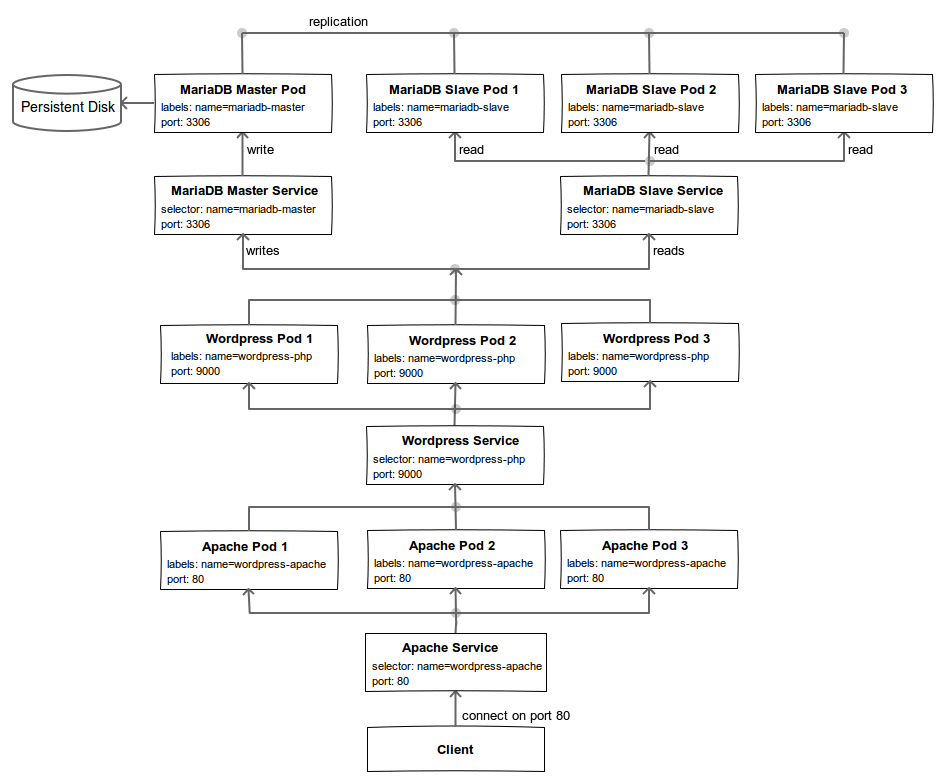
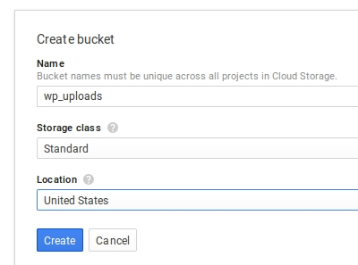
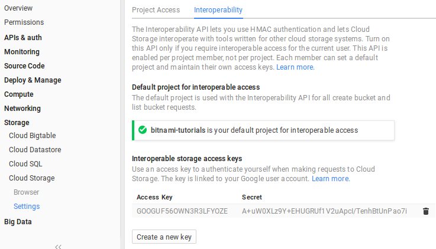
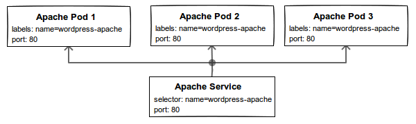

# Scalable Wordpress Blog Using Bitnami Containers, Kubernetes and Google Cloud Platform

- [Prerequisites](#prerequisites)
  + [Container engine environment](#container-engine-environment)
- [Download the configuration files](#download-the-configuration-files)
- [Create the Docker container images](#create-the-docker-container-images)
    - [Wordpress Image](#wordpress-image)
    - [Apache Image](#apache-image)
- [Create your cluster](#create-your-cluster)
- [MariaDB](#mariadb)
  + [Create persistent disk](#create-persistent-disk)
  + [MariaDB master pod and service](#mariadb-master-pod-and-service)
  + [MariaDB slave pod and service](#mariadb-slave-pod-and-service)
- [Wordpress](#wordpress)
  + [Create Google cloud storage bucket](#create-google-cloud-storage-bucket)
  + [Wordpress secret store](#wordpress-secret-store)
  + [Wordpress pod and service](#wordpress-pod-and-service)
- [Apache](#apache)
  + [Apache pod and service](#apache-pod-and-service)
- [Allow external traffic](#allow-external-traffic)
- [Access your Wordpress server](#access-your-wordpress-server)
- [Scaling the Wordpress blog](#scaling-the-wordpress-blog)
- [Take down and restart Wordpress](#take-down-and-restart-wordpress)
- [Cleanup](#cleanup)

This tutorial walks through setting up a scalable [Wordpress](http://wordpress.org) installation on Google Container Engine using the [Bitnami Container Images](https://bitnami.com/docker) for Docker. If you're just looking for the quickest way to get Wordpress up and running you might prefer our [prebuilt installers, VMs and Cloud Images](http://www.bitnami.com/stack/wordpress). If you're interested in getting hands on with [Kubernetes](http://kubernetes.io) and [Google Container Engine](https://cloud.google.com/container-engine/), read on....

The following illustration provides an overview of the architecture we will setup using Kubernetes and Bitnami container images for our Wordpress deployment.



We'll be creating a scalable Wordpress installation backed by a cluster if MariaDB containers which can be scaled horizontally on-demand. We also configure load balancing, an external IP, a secret store and health checks. We use [Google Cloud Storage](https://cloud.google.com/storage/) for persistent file uploads.

## Prerequisites

### Container engine environment

Set up your Google Container Engine environment using [these instructions](https://cloud.google.com/container-engine/docs/before-you-begin).

## Download the configuration files

Clone the [bitnami-docker](https://github.com/bitnami/bitnami-docker) GitHub repository. The files used in this tutorial can be found in the `gke/wordpress` directory of the cloned repository:

```bash
$ git clone https://github.com/bitnami/bitnami-docker.git
$ cd bitnami-docker/gke/wordpress
```

## Create the Docker container images

In this section we'll build the Docker images for our Wordpress blog.

### Wordpress image

The Wordpress image is built using the `Dockerfile` from the `dockerfiles/wordpress-php` directory. Docker container images can extend from other existing images. Since Wordpress is a PHP application, we'll extend from the `bitnami/php-fpm` image.

Our Wordpress image uses the patched versions of the [Amazon Web Services](https://github.com/timwhite/wp-amazon-web-services) and [WP Offload S3](https://github.com/timwhite/wp-amazon-s3-and-cloudfront) plugins for use with Google cloud storage. It also installs the [HyperDB](https://github.com/taskrabbit/makara) plugin to enable support for our database replication backend.

Build the image by running:

```bash
$ cd dockerfiles/wordpress-php/
$ docker build -t gcr.io/<google-project-name>/wordpress-php .
```

Then push this image to the Google Container Registry:

```bash
$ gcloud docker push gcr.io/<google-project-name>/wordpress-php
```

### Apache image

The Apache image is built using the `Dockerfile` from the `dockerfiles/wordpress-apache` directory and it extends the existing `bitnami/apache` image.

This image is used to serve static Wordpress assets (css, js, images, etc). It also adds a catch-all virtual host configuration that proxies requests for dynamic content to the Wordpress container using the TCP socket exposed by the PHP-FPM daemon.

Build the image by running:

```bash
$ cd dockerfiles/wordpress-apache/
$ docker build -t gcr.io/<google-project-name>/wordpress-apache .
```

Then push this image to the Google Container Registry:

```bash
$ gcloud docker push gcr.io/<google-project-name>/wordpress-apache
```

## Create your cluster

Now you are ready to create the Kubernetes cluster on which you'll run Wordpress. A cluster consists of a master API server hosted by Google and a set of worker nodes.

Create a cluster named `wordpress`:

```bash
$ gcloud beta container clusters create wordpress
```

A successful create response looks like:

```
Creating cluster wordpress...done.
Created [.../projects/bitnami-tutorials/zones/us-central1-b/clusters/wordpress].
kubeconfig entry generated for wordpress.
NAME       ZONE           MASTER_VERSION  MASTER_IP      MACHINE_TYPE   STATUS
wordpress  us-central1-b  1.0.6           104.154.78.26  n1-standard-1  RUNNING
```

Now that your cluster is up and running, we are set to launch the components that make up our Wordpress deployment.

## MariaDB


The above diagram illustrates our MariaDB backend. We will create a MariaDB master/slave configuration where the slave pods will replicate the Wordpress database from the master. This will enable us to horizontally scale the MariaDB slave pods when required.

### Create persistent disk

We will make use of [volumes](http://kubernetes.io/v1.0/docs/user-guide/volumes.html) for MariaDB, allowing the database server to preserve its state across pod shutdown and startup.

```bash
$ gcloud compute disks create --size 200GB mariadb-disk
Created [.../projects/bitnami-tutorials/zones/us-central1-b/disks/mariadb-disk].
NAME         ZONE          SIZE_GB TYPE        STATUS
mariadb-disk us-central1-b 200     pd-standard READY
```

The `mariadb-disk` is used in the pod definition of the MariaDB master controller to achieve persistence of the database across startups and shutdowns.

### MariaDB master pod and service

For our Wordpress deployment, the first thing that we're going to do is start a [pod](http://kubernetes.io/v1.0/docs/user-guide/pods.html) for MariaDB master. We'll use a [replication controller](http://kubernetes.io/v1.0/docs/user-guide/replication-controller.html) to create the pod—even though it's a single pod, the controller is still useful for monitoring health and restarting the pod if required.

We'll use the config file `mariadb-master-controller.yml` for the pod which creates a single MariaDB master pod.

> **Note**: You should change the value of the `MARIADB_PASSWORD` and `MARIADB_REPLICATION_PASSWORD` env variables to your choosing.

To create the pod:

```bash
$ kubectl create -f mariadb-master-controller.yml
```

Check to see if the pod is running. It may take a minute to change from `Pending` to `Running`:

```bash
$ kubectl get pods -l name=mariadb-master
NAME                   READY     STATUS    RESTARTS   AGE
mariadb-master-ja9qy   1/1       Running   0          19s
```

A [service](http://kubernetes.io/v1.0/docs/user-guide/services.html) is an abstraction which defines a logical set of pods and a policy by which to access them. It is effectively a named load balancer that proxies traffic to one or more pods.

When you set up a service, you tell it the pods to proxy based on pod labels. Note that the pod that you created in previous step has the label the `name=mariadb-master`.

We'll use the file `mariadb-master-service.yml` to create a service for MariaDB. The `selector` field of the service configuration determines which pods will receive the traffic sent to the service. So, the configuration specifies that we want this service to point to pods labeled with `name=mariadb-master`.

Start the service:

```bash
$ kubectl create -f mariadb-master-service.yml
```

See it running:

```bash
$ kubectl get services mariadb-master
NAME             LABELS                SELECTOR              IP(S)           PORT(S)
mariadb-master   name=mariadb-master   name=mariadb-master   10.247.254.63   3306/TCP
```

### MariaDB slave pod and service

Next we setup the MariaDB slave pods and service. The slave pods will connect to the master service and replicate the Wordpress database.

The `mariadb-slave-controller.yml` config file describes the slave pods and specifies 3 replicas.

> **Note**": You should change the value of the `MARIADB_PASSWORD`, `MARIADB_REPLICATION_PASSWORD` and `MARIADB_MASTER_PASSWORD` env variables with the ones specified in `mariadb-master-controller.yml`

To create the pod:

```bash
$ kubectl create -f mariadb-slave-controller.yml
```

Check to see if the pod is running. It may take a minute to change from `Pending` to `Running`:

```bash
$ kubectl get pods -l name=mariadb-slave
NAME                  READY     STATUS    RESTARTS   AGE
mariadb-slave-55960   1/1       Running   0          14s
mariadb-slave-h8nk7   1/1       Running   0          14s
mariadb-slave-kt7ne   1/1       Running   0          14s
```

As with the MariaDB master pod, we want a service to group the slave pods. We'll use the file `mariadb-slave-service.yml` to create a service.

Start the service:

```bash
$ kubectl create -f mariadb-slave-service.yml
```

See it running:

```bash
$ kubectl get services mariadb-slave
NAME            LABELS               SELECTOR             IP(S)            PORT(S)
mariadb-slave   name=mariadb-slave   name=mariadb-slave   10.247.245.216   3306/TCP
```

## Wordpress

Now that you have the database up and running, lets set up the Wordpress instance.


The above diagram illustrates the Wordpress pod and service configuration.

### Create Google cloud storage bucket

To allow horizontal scaling of the Wordpress blog we'll use the Google cloud storage service, in S3 interoperability mode, to host files uploaded to the Wordpress media library. This also ensures that the uploaded files are persistent across pod startup and shut down as you will see in [Take down and restart Wordpress](#take-down-and-restart-wordpress).

For Wordpress to be able to access the google cloud storage bucket, we need to provide access credentials to our Wordpress pod.

To create a bucket and developer key:

  1. Go to the [Google Developers Console](https://console.developers.google.com/).
  2. Click the name of your project.
  3. In the left sidebar, go to **Storage > Cloud Storage > Browser**.
  4. Select **Create bucket** and give it the name.

  

  5. In the left sidebar, go to **Storage > Cloud Storage > Storage settings**.
  6. Select **Interoperability**.
  7. If you have not set up interoperability before, click **Enable interoperability access**.
  8. Click **Create a new key**.

  

Make a note of the generated **Access Key** and **Secret**, in the next section we'll specify them in the secrets definition.

### Wordpress secret store

A [secret key store](http://kubernetes.io/v1.0/docs/user-guide/secrets.html) is intended to hold sensitive information such as passwords, access keys, etc. Having this information in a key store is safer and more flexible then putting it in to the pod definition.

We will create a key store to save the sensitive configuration parameters of our Wordpress container. This includes, but is not limited to the database password, session tokens, cloud storage access key id and secret.

Lets begin by encoding our secrets in base64, starting with the database password.

```bash
$ base64 -w128 <<< "secretpassword"
c2VjcmV0cGFzc3dvcmQK
```

Next, we encode the S3 access credentials as generated in [Create Google cloud storage bucket](#create-google-cloud-storage-bucket).

```bash
$ base64 <<< "GOOGUF56OWN3R3LFYOZE"
R09PR1VGNTZPV04zUjNMRllPWkUK

$ base64 <<< "A+uW0XLz9Y+EHUGRUf1V2uApcI/TenhBtUnPao7i"
QSt1VzBYTHo5WStFSFVHUlVmMVYydUFwY0kvVGVuaEJ0VW5QYW83aQo=
```

To secure our Wordpress blog we need to generate random and unique hashes for each of the following Wordpress parameters `AUTH_KEY`, `SECURE_AUTH_KEY`, `LOGGED_IN_KEY`, `NONCE_KEY`, `AUTH_SALT`, `SECURE_AUTH_SALT`, `LOGGED_IN_SALT` and `NONCE_SALT`. Generate a random hash for each of these parameters (8 in total) and encode them using `base64`.

```bash
$ base64 -w128 <<< "mCjVXBV6jZVn9RCKsHZFGBcVmpQd8l9s"
bUNqVlhCVjZqWlZuOVJDS3NIWkZHQmNWbXBRZDhsOXMK
```

> **Tip**:  You can use `pwgen -csv1 64` to generate a random and unique 64 character hash value. To generate a random hash and encode it with `base64` in a single command use `base64 -w128 <<< $(pwgen -csv1 64)`

Update `wordpress-secrets.yml` with the `base64` encoded database password, S3 credentials and hashes generated above and create the secret key store using:

```bash
$ kubectl create -f wordpress-secrets.yml
```

See it running:

```bash
$ kubectl get secrets -l name=wordpress-secrets
NAME                TYPE      DATA
wordpress-secrets   Opaque    11
```

This secret key store will be mounted at `/etc/secrets` in read-only mode in the Wordpress pods.

### Wordpress pod and service

The controller and its pod template is described in the file `wordpress-controller.yml`.

> **Note**:
>
> Change the image name to `gcr.io/<google-project-name>/wordpress-php` as per the build instructions in [Wordpress image](#wordpress-image).

It specifies 3 replicas of the pod. Using this file, you can start your Wordpress controller with:

```bash
$ kubectl create -f wordpress-controller.yml
```

Check to see if the pods are running. It may take a few minutes to change from `Pending` to `Running`:

```bash
$ kubectl get pods -l name=wordpress-php
NAME                  READY     STATUS    RESTARTS   AGE
wordpress-php-30vi9   1/1       Running   0          15s
wordpress-php-7nlh4   1/1       Running   0          15s
wordpress-php-yg96d   1/1       Running   0          15s
```

As with the MariaDB pods, we want a service to group the Wordpress pods. The service specification for the Wordpress service is in `wordpress-service.yml`.

Start the service using:

```bash
$ kubectl create -f wordpress-service.yml
```

See it running:

```bash
$ kubectl get services wordpress-php
NAME            LABELS               SELECTOR             IP(S)           PORT(S)
wordpress-php   name=wordpress-php   name=wordpress-php   10.247.250.17   9000/TCP
```

## Apache

Now that we have the MariaDB and Wordpress pods up and running, lets set up the Apache service which will act as the frontend to our Wordpress blog.



The above diagram illustrates the Apache pod and service configuration.

### Apache pod and service

The controller and its pod template is described in the file `apache-controller.yml`.

> **Note**
>
> 1. Change the image name to `gcr.io/<google-project-name>/wordpress-php` as per the build instructions in [Apache image](#apache-image).


It specifies 3 replicas of the server. Using this file, you can start your Apache servers with:

```bash
$ kubectl create -f apache-controller.yml
```

Check to see if the pods are running. It may take a few minutes to change from `Pending` to `Running`:

```bash
$ kubectl get pods -l name=wordpress-apache
NAME                     READY     STATUS    RESTARTS   AGE
wordpress-apache-coou5   1/1       Running   0          16s
wordpress-apache-hzqcq   1/1       Running   0          16s
wordpress-apache-q3v3l   1/1       Running   0          16s
```

Once the servers are up, you can list the pods in the cluster, to verify that they're all running:

```bash
$ kubectl get pods
NAME                     READY     STATUS    RESTARTS   AGE
mariadb-master-ja9qy     1/1       Running   0          3m
mariadb-slave-55960      1/1       Running   0          2m
mariadb-slave-h8nk7      1/1       Running   0          2m
mariadb-slave-kt7ne      1/1       Running   0          2m
wordpress-apache-coou5   1/1       Running   0          37s
wordpress-apache-hzqcq   1/1       Running   0          37s
wordpress-apache-q3v3l   1/1       Running   0          37s
wordpress-php-30vi9      1/1       Running   0          1m
wordpress-php-7nlh4      1/1       Running   0          1m
wordpress-php-yg96d      1/1       Running   0          1m
```

You'll see a single MariaDB master pod, three MariaDB slave pods, three Wordpress pods and three Apache pods. In [Scaling the Wordpress blog](#scaling-the-wordpress-blog) we'll see how we can scale the MariaDB slave, Wordpress and Apache pods.

As with the other pods, we want a service to group the Apache pods. However, this time it's different: this service is user-facing, so we want it to be externally visible. That is, we want a client to be able to request the service from outside the cluster. To accomplish this, we can set the `type: LoadBalancer` field in the service configuration.

The service specification for the Apache is in `apache-service.yml`.

```bash
$ kubectl create -f apache-service.yml
```

See it running:

```bash
$ kubectl get services wordpress-apache
NAME               LABELS                  SELECTOR                IP(S)           PORT(S)
wordpress-apache   name=wordpress-apache   name=wordpress-apache   10.247.252.50   80/TCP
```

## Allow external traffic

By default, the pod is only accessible by its internal IP within the cluster. In order to make the Wordpress service accessible from the internet we have to open port 80.

First we need to get the node prefix for the cluster using:

```bash
$ kubectl get nodes
NAME                               LABELS                                                    STATUS
gke-wordpress-17345479-node-6v8x   kubernetes.io/hostname=gke-wordpress-17345479-node-6v8x   Ready
gke-wordpress-17345479-node-8b0v   kubernetes.io/hostname=gke-wordpress-17345479-node-8b0v   Ready
gke-wordpress-17345479-node-wef4   kubernetes.io/hostname=gke-wordpress-17345479-node-wef4   Ready
```

The value of `--target-tag` in the command below is the node prefix for the cluster up to `-node`.

```bash
$ gcloud compute firewall-rules create --allow=tcp:80 \
    --target-tags=gke-wordpress-17345479-node wordpress-http
```

A successful response looks like:

```bash
Created [.../projects/bitnami-tutorials/global/firewalls/wordpress-http].
NAME           NETWORK SRC_RANGES RULES  SRC_TAGS TARGET_TAGS
wordpress-http default 0.0.0.0/0  tcp:80          gke-wordpress-17345479-node
```

Alternatively, you can open up port 80 from the [Developers Console](https://console.developers.google.com/).

## Access your Wordpress server

Now that the firewall is open, you can access the service. Find the external IP of the Apache service you just set up:

```bash
$ kubectl describe services wordpress-apache
Name:                   wordpress-apache
Namespace:              default
Labels:                 name=wordpress-apache
Selector:               name=wordpress-apache
Type:                   LoadBalancer
IP:                     10.247.252.50
LoadBalancer Ingress:   104.197.94.0
Port:                   <unnamed> 80/TCP
NodePort:               <unnamed> 31191/TCP
Endpoints:              10.244.0.8:80,10.244.1.4:80,10.244.2.7:80
Session Affinity:       None
No events.
```

Then, visit `http://x.x.x.x` in your favourite web browser, where `x.x.x.x` is the IP address listed next to `LoadBalancer Ingress` in the response. You will be greeted with the Wordpress setup page.

After completing the setup, access the Wordpress administration panel

  1. On the left sidebar click on **Plugins**
  2. Activate the **Amazon Web Services** and **WP Offload S3** plugins
  3. Load the **Settings** panel of **WP Offload S3**
  4. Enter the bucket name created in [Create Google cloud storage bucket](#create-google-cloud-storage-bucket)
  5. Turn on the **Remove Files From Server** setting
  6. Save Changes

You now have a scalable Wordpress blog. The next section demonstrates how the blog can be scaled, without any downtime, to meet the growing demands of your soon to be successfully blog.

## Scaling the Wordpress blog

Since the MariaDB slave, Wordpress and Apache pods are defined as services that use a replication controller, you can easily resize the number of pods in the replication controller as follows:

To scale the MariaDB slave pods:

```bash
$ kubectl scale --replicas=5 rc mariadb-slave
```

The configuration for the controllers will be updated, to specify that there should be 5 replicas running. The replication controller adjusts the number of pods it is running to match that, and you will be able to see the additional pods running:

```bash
$ kubectl get pods -l name=mariadb-slave
NAME                  READY     STATUS    RESTARTS   AGE
mariadb-slave-55960   1/1       Running   0          7m
mariadb-slave-h8nk7   1/1       Running   0          7m
mariadb-slave-kt7ne   1/1       Running   0          7m
mariadb-slave-rdlsh   1/1       Running   0          10s
mariadb-slave-t9b4p   1/1       Running   0          10s
```

Similarly to scale the Wordpress pods use:

```bash
$ kubectl scale --replicas=5 rc wordpress-php
```

and to scale the Apache pods use:

```bash
$ kubectl scale --replicas=5 rc wordpress-apache
```

You can scale down in the same manner.

## Take down and restart Wordpress

Because we used a persistent disk for the MariaDB pod and used Google cloud storage for files uploaded in Wordpress, your Wordpress state is preserved even when the pods it's running on are deleted. Lets try it.

```bash
$ kubectl delete rc wordpress-apache
$ kubectl delete rc wordpress-php
$ kubectl delete rc mariadb-slave
$ kubectl delete rc mariadb-master
```

*Deleting the replication controller also deletes its pods.*

Confirm that the pods have been deleted:

```bash
$ kubectl get pods
```

Then re-create the pods:

```bash
$ kubectl create -f mariadb-master-controller.yml
$ kubectl create -f mariadb-slave-controller.yml
$ kubectl create -f wordpress-controller.yml
$ kubectl create -f apache-controller.yml
```

Once the pods have restarted, the `mariadb-master`, `mariadb-slave`, `wordpress-php` and `wordpress-apache` services pick them up immediately based on their labels, and your Wordpress blog is restored.

## Cleanup

To delete your application completely:

*If you intend to teardown the entire cluster then jump to Step 4.*

  1. Delete the controllers:

  ```bash
  $ kubectl delete rc wordpress-apache
  $ kubectl delete rc wordpress-php
  $ kubectl delete rc mariadb-slave
  $ kubectl delete rc mariadb-master
  ```

  2. Delete the services:

  ```bash
  $ kubectl delete service wordpress-apache
  $ kubectl delete service wordpress-php
  $ kubectl delete service mariadb-slave
  $ kubectl delete service mariadb-master
  ```

  3. Delete the secret key store

  ```bash
  $ kubectl delete secret wordpress-secrets
  ```

  4. Delete your cluster:

  ```bash
  $ gcloud beta container clusters delete wordpress
  ```

  5. Delete the firewall rule:

  ```bash
  $ gcloud compute firewall-rules delete wordpress-http
  ```

  6. Delete the disks:

  ```bash
  $ gcloud compute disks delete mariadb-disk
  ```

  7. Delete the bucket and developer key from the [Google Developers Console](https://console.developers.google.com/)
