# Scalable Redmine Using Bitnami Containers, Kubernetes and VMware vCloud Air

## Prerequisites

### VMware vCloud Air

Signup for a [VMware vCloud Air](https://signupvcloud.vmware.com/1094/purl-signup).

### Download the configuration files

Clone the [bitnami-docker](https://github.com/bitnami/bitnami-docker) GitHub repository:

```bash
git clone https://github.com/bitnami/bitnami-docker.git
```

The files used in this tutorial can be found in the `vcloud/redmine` directory of the cloned repository:

  - Dockerfile
  - run.sh
  - redmine-secrets.yml
  - redmine-controller.yml
  - redmine-service.yml
  - mariadb-controller.yml
  - mariadb-service.yml

## Create a Docker container image

The Redmine image is built using the `Dockerfile` and `run.sh` script. Docker container images can extend from other existing images so for this image, we'll extend from the existing `bitnami/ruby` image.

The `Dockerfile` imports the correct Redmine source code and a `run.sh` script.

The `run.sh` script uses the MariaDB connection information exposed by docker links and automatically configures the Redmine database connection parameters.

Build the Redmine image by running:

```bash
$ docker build -t <dockerhub-account-name>/redmine .
```

Then push this image to the Docker Hub Registry:

```bash
$ docker push <dockerhub-account-name>/redmine
```

## Create your Kubernetes cluster on vCloud Air

In this section we will talk through setting up a Kubernetes cluster on vCloud Air.

Lets begin by logging in to our vCloud Air account.

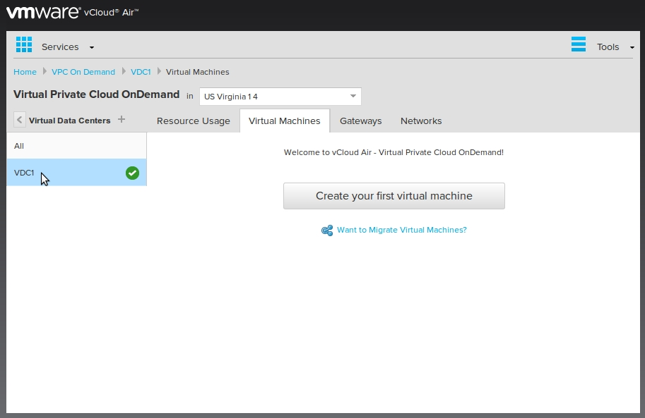

### Network Configuration

Before we start creating virtual machines (VM) for the Kubernetes cluster, we need to perform some network configurations to allow oubound network connections from our VM's.

We begin by assigning a public IP address to the gateway interface. This will allow us to access the services running on the cluster over the internet.

Browse to the **Gateways** tab and select the listed gateway interface.

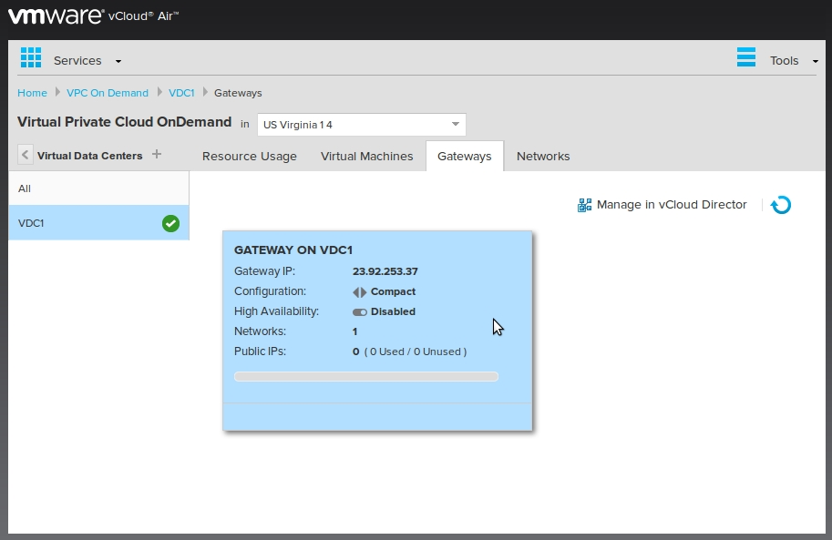

Next, select the **Public IPs** tab and click the **Add IP Address** button to add a public IP address.

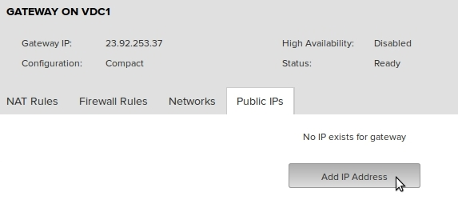

The public IP address will now be listed. Copy the displayed IP address as it will be used in the following sections.

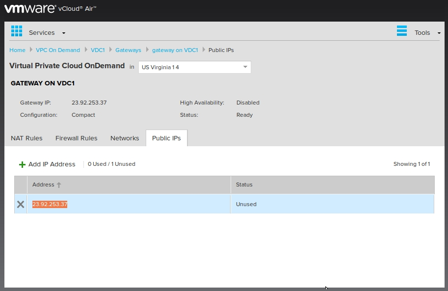

Next we will add a Source NAT (SNAT) rule. Select the **NAT Rules** tab and add a new SNAT rule as displayed in the below screenshot.

> **Note!**: The IP address entered in the **Translated (External) Source** is the public IP address of our Gateway.

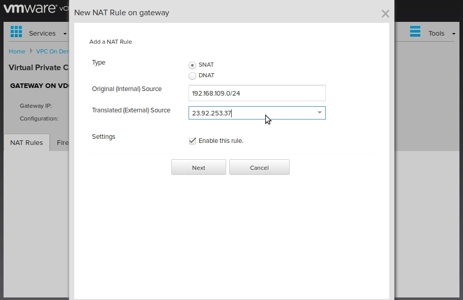

Next, we need to add a firewall rule to allow outgoing network connections from our virtual machines.

Select the **Firewall Rules** tab and add a new rule named **outbound-ALL** as shown in the screenshot below.

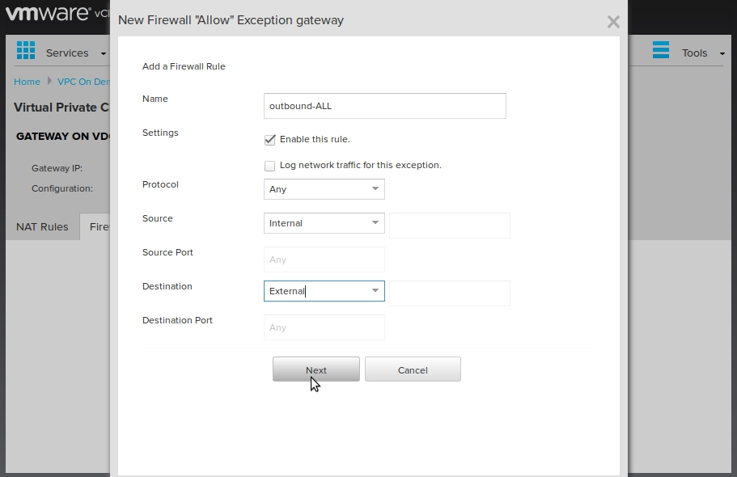

Optionally, we can add an **inbound-ICMP** rule as shown below. This will allow us to ping the gateway.

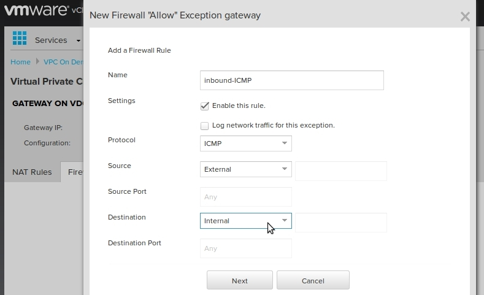

After performing the above firewall configurations the firewall rules will look something like this.

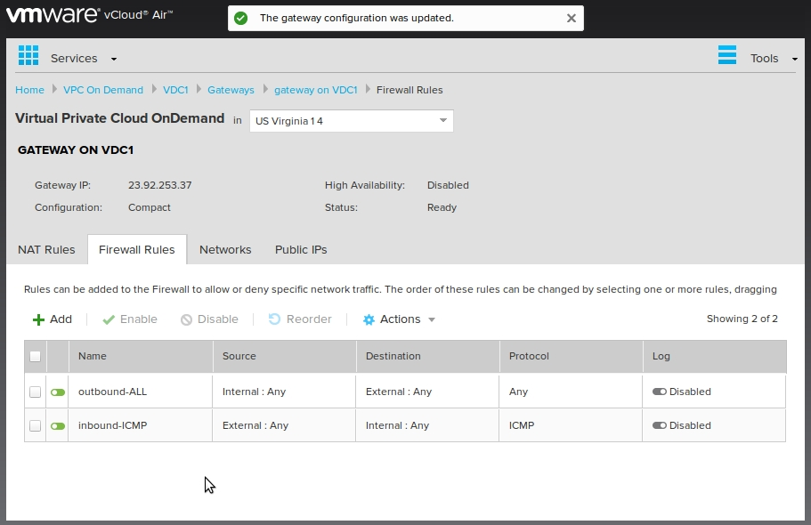

To complete our network configuration, we need to configure the DNS addresses that will be configured on the VM's.

Select the **Networks** tab and click the **Manage in vCloud Director** link. vCloud Director will open in a new browser tab.

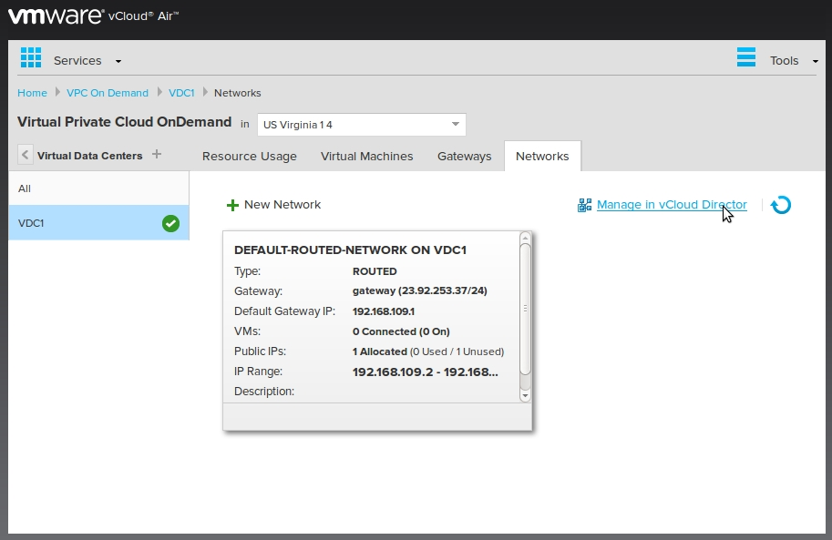

*Please note that vCloud Director requires the Adobe Flash web-browser plugin*

In vCloud Director select the **default-routed-network** and load the **Properties** dialog as displayed in the screenshot below.

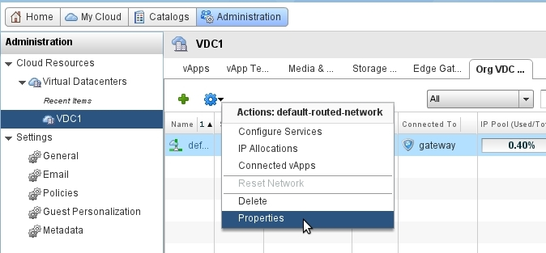

Under the DNS settings enter the address of the DNS server you want to use and apply the changes. In this tutorial we use Google's Public DNS servers `8.8.8.8` and `8.8.4.4`.

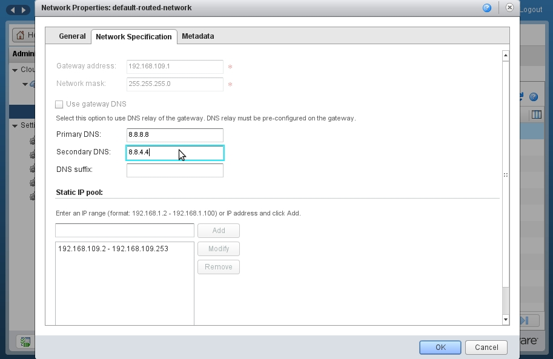

And we are done with the network configuration. In the following sections we will setup the Kubernetes master and worker nodes.

### Kubernetes master

A Kubernetes cluster consists on one master node and one or more worker nodes. In this section we will create a virtual machine for the master node.

#### Create virtual machine

Begin by creating a new virtual machine.

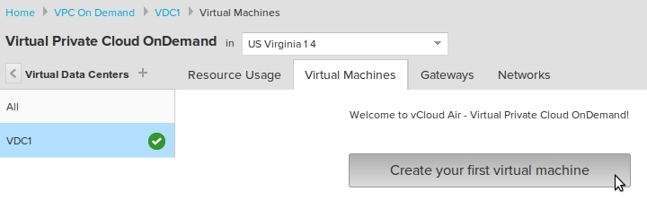

Select the **Ubuntu 12.04 Server AMD64** virtual machine template from the VMware Catalog.

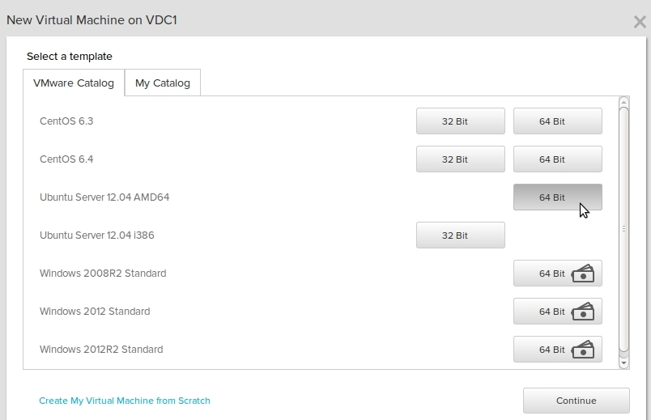

Name the virtual machine **k8s-master** and assign the desired system resources to the VM and create the virtual machine.

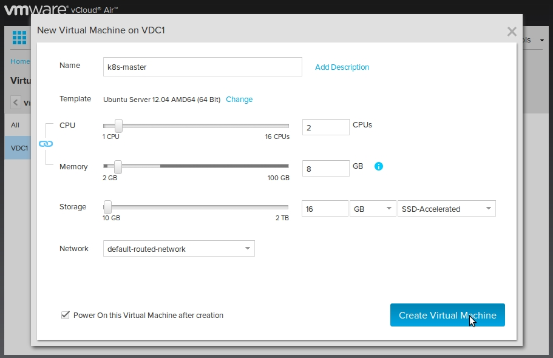

A VM named **ks8-master** should now be listed under the **Virtual Machines** tab and should enter the powered on state in a couple of minutes.

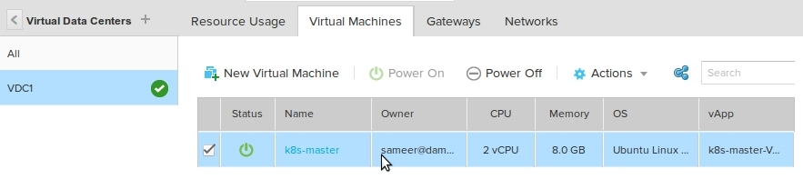

Select the VM to view its settings and properties.

Under the **Networks** tab you will find the IP address of the virtual machine. Please note it down as it will be required later.

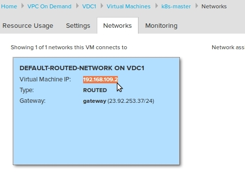

Under the **Settings** tab you will find the **Guest OS Password** and also a link to **Open Virtual Machine Console**. Click this link to open a console session to the VM. Upon login as `root` user, you will be required change the default password.

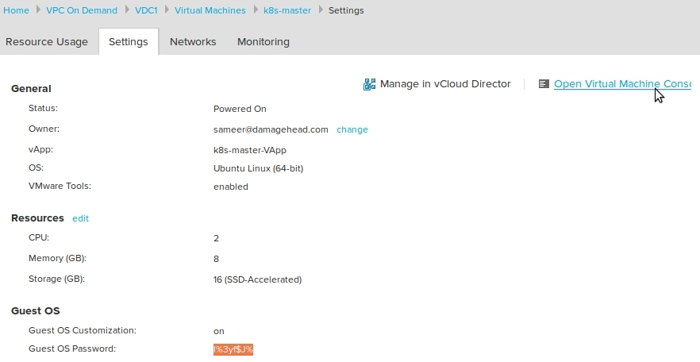

#### Allow remote SSH connections (Optional)

Optionally we can update the network configuration to allow incoming SSH connections to our **k8s-master** VM.

Add a new **DNAT** rule under the **Gateway > NAT** section as shown below. Set the **Original (External) IP** to the public IP address of the gateway and the **Translated (Internal) IP/Range** to the IP address of the VM.

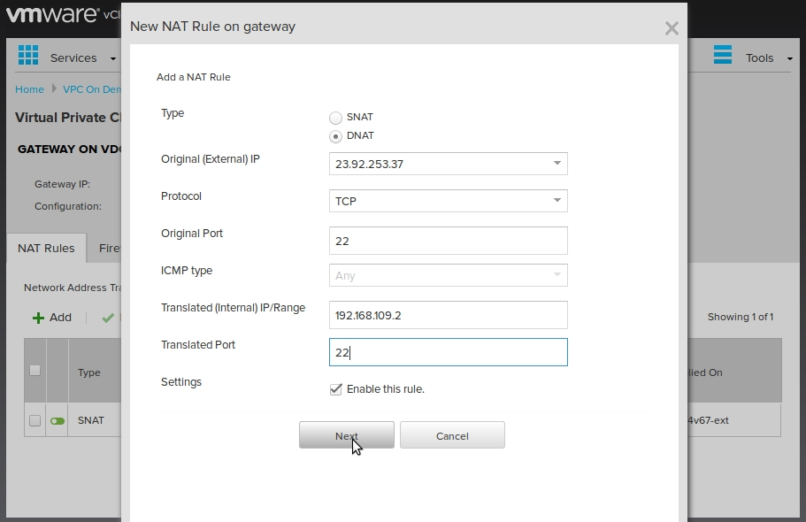

After performing the above NAT configuration the NAT Rules will look something like this.

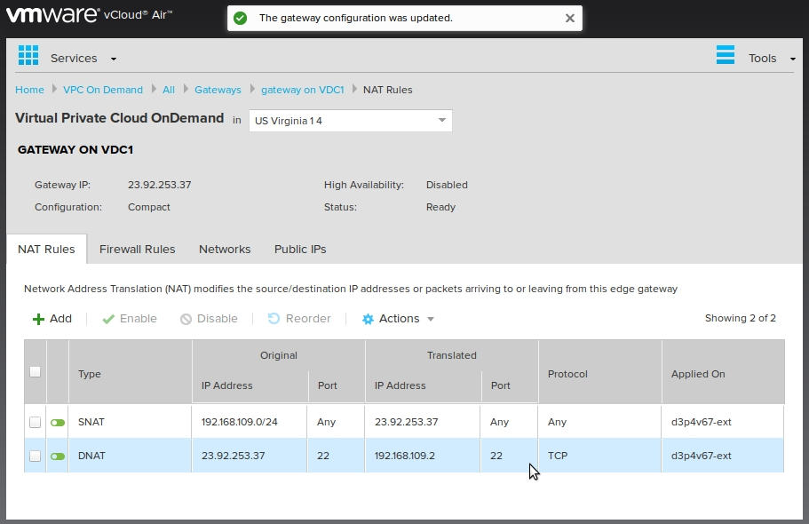

Next, we need to add a firewall rule to allow inbound SSH connections to the **k8s-master** VM.

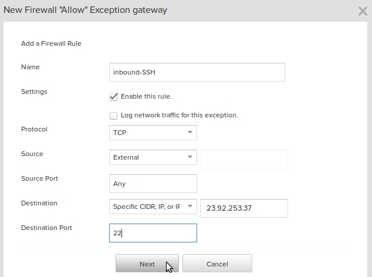

After performing the above firewall configurations the firewall rules will look something like this.

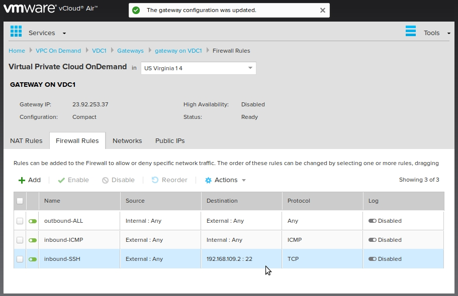

With this configuration, you should now be able to login to the **ks-master** VM using an SSH client.

#### Setting up the master node

Begin by updating the system packages.

```bash
$ apt-get update && apt-get -y upgrade
```

*It recommended that you reboot the VM after updating the system*

Next we install Docker, followed by the Kubernetes `kubectl` command.

```bash
$ curl -sSL https://get.docker.com/ | sh
```

Set `K8S_VERSION` to the most recent Kubernetes release

```bash
$ export K8S_VERSION=1.0.3
```

Install the `kubectl` command.

```bash
$ wget https://github.com/kubernetes/kubernetes/releases/download/v${K8S_VERSION}/kubernetes.tar.gz
$ tar xf kubernetes.tar.gz
$ cp kubernetes/platforms/linux/$(dpkg --print-architecture)/kubectl /usr/local/bin
$ chmod +x /usr/local/bin/kubectl
```

Finally we setup the VM to be the master node of the Kubernetes cluster.

```bash
$ wget https://raw.githubusercontent.com/kubernetes/kubernetes/master/docs/getting-started-guides/docker-multinode/master.sh
$ chmod +x master.sh
$ ./master.sh
```

This process will take a while to complete at the end of which we should have a working Kubernetes master node.

While the node is being setup, you can go ahead and setup one or more worker nodes.

### Kubernetes Worker

#### Create virtual machine

Similar to creating a VM for the master node, we create a VM for the worker node.

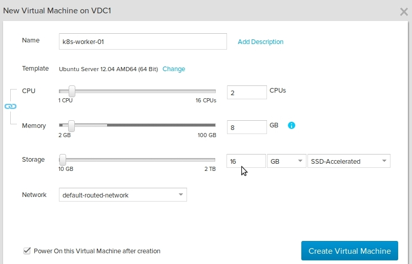

Name the virtual machine **k8s-worker-01** and assign the desired system resources to the VM and create the virtual machine.

A VM named **ks8-worker-01** should now be listed under the **Virtual Machines** tab and should enter the powered on state in a couple of minutes.

#### Setting up the worker node

Login to the worker node and begin by updating the system packages.

```bash
$ apt-get update && apt-get -y upgrade
```

*It recommended that you reboot the VM after updating the system*

Next we install Docker, followed by the Kubernetes `kubectl` command.

```bash
$ curl -sSL https://get.docker.com/ | sh
```

Set `K8S_VERSION` to the most recent Kubernetes release

```bash
$ export K8S_VERSION=1.0.3
```

Install the `kubectl` command.

```bash
$ wget https://github.com/kubernetes/kubernetes/releases/download/v${K8S_VERSION}/kubernetes.tar.gz
$ tar xf kubernetes.tar.gz
$ cp kubernetes/platforms/linux/$(dpkg --print-architecture)/kubectl /usr/local/bin
$ chmod +x /usr/local/bin/kubectl
```

Finally we setup the VM as a worker node of the Kubernetes cluster. First set the `MASTER_IP` environment variable to the IP address of the **ks8-master** VM.

```bash
$ export MASTER_IP=192.168.109.2
```

And begin the install.

```bash
$ wget https://raw.githubusercontent.com/kubernetes/kubernetes/master/docs/getting-started-guides/docker-multinode/worker.sh
$ chmod +x worker.sh
$ ./worker.sh
```

Like the master node setup, the this process will take a while to complete at the end of which the worker should be ready.

You can repeat the instructions in [Kubernetes Worker](#kubernetes-worker) to add more worker nodes if you wish to.

### Deploy DNS

To complete the setup of our Kubernetes cluster we need to deploy a DNS. These instructions can be executed on the master node or any of the worker nodes.

First, download the configuration templates.

```bash
$ wget https://raw.githubusercontent.com/kubernetes/kubernetes/master/docs/getting-started-guides/docker-multinode/skydns-rc.yaml.in
$ wget https://raw.githubusercontent.com/kubernetes/kubernetes/master/docs/getting-started-guides/docker-multinode/skydns-svc.yaml.in
```

Next, we need to configure some environment variables, namely `DNS_REPLICAS` , `DNS_DOMAIN` , `DNS_SERVER_IP` , `KUBE_SERVER`. Set the `KUBE_SERVER` variable to the IP address of the **k8s-master** VM.

```bash
$ export DNS_REPLICAS=1
$ export DNS_DOMAIN=cluster.local
$ export DNS_SERVER_IP=10.0.0.10
$ export KUBE_SERVER=192.168.109.2
```

Next we generate the configuration using the templates and the above configuration.

```bash
$ sed -e "s/{{ pillar\['dns_replicas'\] }}/${DNS_REPLICAS}/g;s/{{ pillar\['dns_domain'\] }}/${DNS_DOMAIN}/g;s/{kube_server_url}/${KUBE_SERVER}/g;" skydns-rc.yaml.in > ./skydns-rc.yaml
$ sed -e "s/{{ pillar\['dns_server'\] }}/${DNS_SERVER_IP}/g" skydns-svc.yaml.in > ./skydns-svc.yaml
```

Now use `kubectl` to create the `skydns` replication controller.

```bash
$ kubectl -s "$KUBE_SERVER:8080" --namespace=kube-system create -f ./skydns-rc.yaml
```

Wait for the pods to enter the `Running` state.

```bash
$ kubectl -s "$KUBE_SERVER:8080" --namespace=kube-system get pods
NAME                READY     STATUS    RESTARTS   AGE
kube-dns-v8-rh7lz   4/4       Running   0          2m
```

Once the pods are in the `Running` state, create the `skydns` service using `kubectl`.

```bash
$ kubectl -s "$KUBE_SERVER:8080" --namespace=kube-system create -f ./skydns-svc.yaml
```

Lets perform some basic checks to see if the Kubernetes cluster has been setup correctly.

```bash
$ kubectl -s "$KUBE_SERVER:8080" get nodes
NAME        LABELS                             STATUS
127.0.0.1   kubernetes.io/hostname=127.0.0.1   Ready
127.0.1.1   kubernetes.io/hostname=127.0.1.1   Ready
```

```bash
$ kubectl --namespace=kube-system get pods
NAME                READY     STATUS    RESTARTS   AGE
kube-dns-v8-rh7lz   4/4       Running   0          4m
```

```bash
$ kubectl --namespace=kube-system get services
NAME       LABELS                                                                           SELECTOR           IP(S)       PORT(S)
kube-dns   k8s-app=kube-dns,kubernetes.io/cluster-service=true,kubernetes.io/name=KubeDNS   k8s-app=kube-dns   10.0.0.10   53/UDP
                                                                                                                           53/TCP
```

And there you have it, we have a Kubernetes cluster setup on vCloud Air. You can run further tests on your cluster using these instructions: https://github.com/kubernetes/kubernetes/blob/master/docs/getting-started-guides/docker-multinode/testing.md

## MariaDB pod and service

### MariaDB pod

The first thing that we're going to do is start a [pod](http://kubernetes.io/v1.0/docs/user-guide/pods.html) for MariaDB. We'll use a [replication controller](http://kubernetes.io/v1.0/docs/user-guide/replication-controller.html) to create the pod—even though it's a single pod, the controller is still useful for monitoring health and restarting the pod if required.

We'll use the config file `mariadb-controller.yml` for the database pod. The pod definition creates a single MariaDB pod.

> **Note**": You should change the value of the `MARIADB_PASSWORD` env variable to one of your choosing.

To create the pod:

```bash
$ kubectl create -f mariadb-controller.yml
```

Check to see if the pod is running. It may take a minute to change from `Pending` to `Running`:

```bash
$ kubectl get pods -l name=mariadb
NAME            READY     STATUS    RESTARTS   AGE
mariadb-izq2p   1/1       Running   0          5m
```

### MariaDB service

A [service](http://kubernetes.io/v1.0/docs/user-guide/services.html) is an abstraction which defines a logical set of pods and a policy by which to access them. It is effectively a named load balancer that proxies traffic to one or more pods.

When you set up a service, you tell it the pods to proxy based on pod labels. Note that the pod that you created in step one has the label `name=mariadb`.

We'll use the file `mariadb-service.yml` to create a service for MariaDB:

The `selector` field of the service configuration determines which pods will receive the traffic sent to the service. So, the configuration is specifying that we want this service to point to pods labeled with `name=mariadb`.

Start the service:

```bash
$ kubectl create -f mariadb-service.yml
```

See it running:

```bash
$ kubectl get services mariadb
NAME      LABELS         SELECTOR       IP(S)        PORT(S)
mariadb   name=mariadb   name=mariadb   10.0.0.143   3306/TCP
```

## Redmine pod and service

Now that you have the database up and running, lets set up the Redmine web servers.

### Redmine pod

The controller and its pod template is described in the file `redmine-controller.yml`.

> **Note**:
> 1. Change the image name to `<dockerhub-account-name>/redmine` as per the build instructions in [Create a Docker container image](#create-a-docker-container-image).
> 2. Update the values of `REDMINE_SESSION_TOKEN` and `DATABASE_PASSWORD`.

It specifies 3 replicas of the server. Using this file, you can start your Redmine servers with:

```bash
$ kubectl create -f redmine-controller.yml
```

Check to see if the pods are running. It may take a few minutes to change from `Pending` to `Running`:

```bash
$ kubectl get pods -l name=redmine
NAME            READY     STATUS    RESTARTS   AGE
redmine-8qqfv   1/1       Running   0          5m
redmine-tc4oi   1/1       Running   0          5m
redmine-xj3mh   1/1       Running   0          5m
```

Once the servers are up, you can list the pods in the cluster, to verify that they're all running:

```bash
$ kubectl get pods
NAME                   READY     STATUS    RESTARTS   AGE
k8s-master-127.0.0.1   3/3       Running   0          1d
mariadb-izq2p          1/1       Running   0          32m
redmine-8qqfv          1/1       Running   0          6m
redmine-tc4oi          1/1       Running   0          6m
redmine-xj3mh          1/1       Running   0          6m
```

You'll see a single MariaDB pod and three Redmine pods and some infrastructure pods. In [Scaling the Redmine application](#scaling-the-redmine-application) we will see how we can scale the Redmine pods.

### Redmine service

As with the MariaDB pod, we want a service to group the Redmine server pods. However, this time it's different: this service is user-facing, so we want it to be externally visible. That is, we want a client to be able to request the service from outside the cluster. To accomplish this, we can set the `type: NodePort` field and specify `nodePort: 30000` in the service configuration.

The service specification for the Redmine is in `redmine-service.yml`.

```bash
$ kubectl create -f redmine-service.yml
```

See it running:

```bash
$ kubectl get services redmine
NAME      LABELS         SELECTOR       IP(S)        PORT(S)
redmine   name=redmine   name=redmine   10.0.0.226   80/TCP
```

## Allow external traffic

By default, the pod is only accessible by its internal IP within the cluster. In order to make the Redmine service accessible from the Internet we have to open port 80 and forward it to port `30000` (`nodePort`) of our master node.

Login to the vCloud Air interface and update the **Gateway > NAT Rules** configuration as showing in the screenshot below.

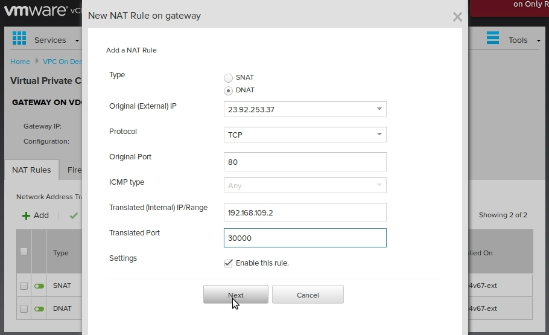

Next, go to the **Gateway > Firewall Rules** configuration page and add the **inbound-HTTP** rule as shown in the screenshot below:

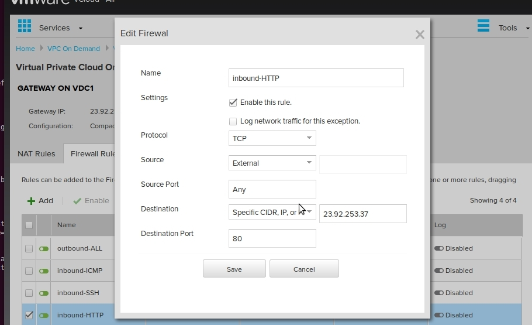

## Access your Redmine server

Now that the firewall is open, you can access the service using the public IP address of your gateway. Visit `http://x.x.x.x` where `x.x.x.x` is the public IP address of the gateway from the [Network Configuration](#network-configuration) section.
