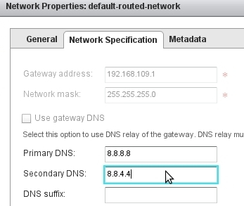
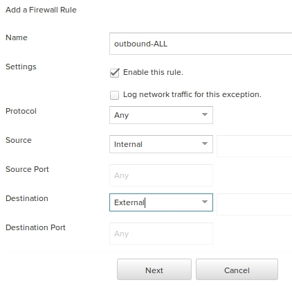
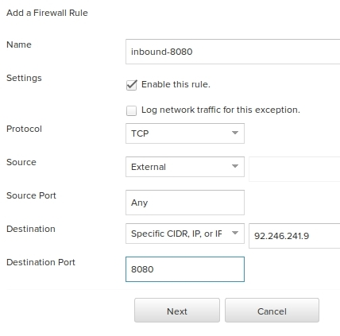
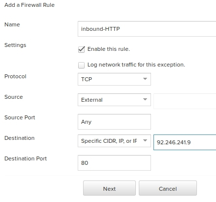

# Scalable Redmine Using Bitnami Containers, Kubernetes and VMware vCloud Air

- [Prerequisites](#prerequisites)
    - [VMware vCloud Air](#vmware-vcloud-air)
    - [vCloud Air CLI](#vcloud-air-cli)
- [Create your cluster](#create-your-cluster)
    - [Network Configuration](#network-configuration)
    - [Kubernetes master](#kubernetes-master)
        - [Create master VM](#create-master-vm)
        - [Allow remote SSH connections (Optional)](#allow-remote-ssh-connections-optional)
        - [Setting up the master node](#setting-up-the-master-node)
    - [Kubernetes Worker](#kubernetes-worker)
        - [Create worker VM](#create-worker-vm)
        - [Setting up the worker node](#setting-up-the-worker-node)
- [Download the configuration files](#download-the-configuration-files)
- [Create the Docker container images](#create-the-docker-container-images)
    - [FakeS3 Image](#fakes3-image)
    - [Redmine Image](#redmine-image)
- [MariaDB pod and service](#mariadb-pod-and-service)
    - [MariaDB pod](#mariadb-pod)
    - [MariaDB service](#mariadb-service)
- [FakeS3 pod and service](#fakes3-pod-and-service)
    - [FakeS3 pod](#fakes3-pod)
    - [FakeS3 service](#fakes3-service)
- [Redmine pod and service](#redmine-pod-and-service)
    - [Redmine pod](#redmine-pod)
    - [Redmine service](#redmine-service)
- [Allow external traffic](#allow-external-traffic)
- [Access your Redmine server](#access-your-redmine-server)
- [Scaling the Redmine application](#scaling-the-redmine-application)
- [Take down and restart Redmine](#take-down-and-restart-redmine)
- [Cleanup](#cleanup)
- [Possible improvements](#possible-improvements)
    - [Use secret volume to store sensitive information](#use-secret-volume-to-store-sensitive-information)
    - [Use persistent volumes for MariaDB and Fakes3 controllers](#use-persistent-volumes-for-mariadb-and-fakes3-controllers)
    - [Add health checks to FakeS3 controller](#add-health-checks-to-fakes3-controller)

This tutorial walks through setting up a scalable [Redmine](http://redmine.org) installation on VMware vCloud Air using the [Bitnami Container Images](https://bitnami.com/docker) for Docker and deployed using Kubernetes. If you're just looking for the quickest way to get Redmine up and running you might prefer our [prebuilt installers, VMs and Cloud Images](http://www.bitnami.com/stack/redmine). If you're interested in getting hands on with [Kubernetes](http://kubernetes.io) and [vCloud Air](https://vcloud.vmware.com), read on....

We'll be creating a scalable Redmine installation backed by an instance of MariaDB and [FakeS3](https://github.com/jubos/fake-s3). We also configure load balancing, an external IP and health checks.

We use the FakeS3 instance for file uploads in Redmine using the [Redmine S3](https://github.com/ka8725/redmine_s3) plug-in. FakeS3 is a lightweight server clone of Amazon S3 that simulates most of the commands supported by S3. If you want to instead use the Amazon AWS service or some other compatible service then you can skip the instructions in [FakeS3 Image](#fakes3-image) and [FakeS3 pod and service](#fakes3-pod-and-service).

We'll be setting up the infrastructure such that the Redmine application will be accessible at https://redmine.example.com and the S3 bucket hosting the Redmine files will be accessible at http://redmine.s3.example.com.

## Prerequisites

### VMware vCloud Air

Since we this tutorial demonstrates use of Bitnami containers on VMware vCloud Air using Kubernetes, you will need a vCloud Air account. If you do not already have one, you can [signup](https://signupvcloud.vmware.com/1094/purl-signup) for one. Upon signup you will receive $300 or 3 months (whichever comes first) in vCloud Air OnDemand service credits.

#### vCloud Air CLI

We'll use VMware's [vca-cli](https://github.com/vmware/vca-cli) tool to interact with the vCloud Air API. Follow these instructions to install the `vca` tool:

```bash
$ sudo apt-get update
$ sudo apt-get install -y build-essential libffi-dev libssl-dev \
    libxml2-dev libxslt-dev python-dev
$ wget https://bootstrap.pypa.io/get-pip.py
$ sudo python get-pip.py
$ sudo pip install vca-cli
```

Confirm that the tool is installed and working by performing a version check:

```bash
$ vca --version
vca-cli version 14 (pyvcloud: 14)
```

If you see `insecureplatformwarning` warnings while executing `vca`, install the `requests[security]` python package using:

```bash
$ pip install requests[security]
```

## Create your cluster

Before you get to creating the Kubernetes cluster, we need to login to vCloud Air using the `vca` tool.

```bash
$ vca login user@company.com
```

Once logged in we can list the available instances using:

```bash
$ vca instance
| Service Group   | Region            | Plan                           | Instance Id                          | Selected   |
|-----------------+-------------------+--------------------------------+--------------------------------------+------------|
| M159692122      | us-virginia-1-4   | Virtual Private Cloud OnDemand | fb35cb94-0a90-42c3-8193-d400ec1f58fb |            |
| M159692122      | jp-japanwest-1-10 | Virtual Private Cloud OnDemand | 596f0a15-e944-40ff-a0ce-65cf5b27851e |            |
| M159692122      | de-germany-1-16   | Virtual Private Cloud OnDemand | 06290eca-4584-4c20-acb2-25126e44be9c |            |
| M159692122      | us-california-1-3 | Virtual Private Cloud OnDemand | 41d63a80-4148-408e-bc7d-0a0c5b87c800 |            |
```

This command lists the locations at which you can create Virtual Data Center's (VDC). In this tutorial we use the instance located in Germany. You can choose any location, perhaps you want to use a location that is closer to you.

If you do not see more than one location in the output of the above command, you can enable the other locations using the dropdown list in vCloud Air's web interface. Remember to execute the above command again to get the `Instance Id` of the activated locations.


> **Note!**: If you face issues following this tutorial, please try switching to a different location.

```bash
$ vca instance use --instance 06290eca-4584-4c20-acb2-25126e44be9c
```

We can list the existing VDC's using the command `vca vdc` and use any of the listed VDC's, however for this tutorial we'll create a new VDC named **Kubernetes**.

VDC's are created from VDC templates. A VDC template specifies a VDC configuration. If the configuration includes an EdgeGateway, the VDC can support creation of routed organization VDC networks. We can list the existing VDC templates using:

```bash
$ vca org list-templates
| Template         |
|------------------|
| VPC Subscription |
| d11p16v3-tp      |
| d11p16v9-tp      |
| dr-d11p16v3-tp   |
```

Use the existing `VPC Subscription` template to create our **Kubernetes** VDC.

```bash
$ vca vdc create --vdc Kubernetes --template 'VPC Subscription'
```

Once the VDC is created we need to configure `vca` to use it:

```bash
$ vca vdc use --vdc Kubernetes
```

Check the configuration status using:

```bash
$ vca status
| Key              | Value                                                            |
|------------------+------------------------------------------------------------------|
| vca_cli_version  | 14                                                               |
| pyvcloud_version | 14                                                               |
| profile_file     | /home/user/.vcarc                                                |
| profile          | default                                                          |
| host             | https://vca.vmware.com                                           |
| host_score       | https://score.vca.io                                             |
| user             | user@example.com                                                 |
| instance         | 06290eca-4584-4c20-acb2-25126e44be9c                             |
| org              | 494267b8-b8c2-477a-9f83-3c6121aedb0d                             |
| vdc              | Kubernetes                                                       |
| gateway          | gateway                                                          |
| password         | <encrypted>                                                      |
| type             | vca                                                              |
| version          | 5.7                                                              |
| org_url          | https://de-germany-1-16.vchs.vmware.com/api/compute/api/sessions |
| active session   | True                                                             |
```

> **Note!**: If you are logged out from the `vca` login, you can directly login and start using the Kubernetes cluster using:
>
> ```bash
> $ vca login user@company.com --instance 06290eca-4584-4c20-acb2-25126e44be9c --vdc Kubernetes
> ```

### Network Configuration

Before we start creating virtual machines (VM) for the Kubernetes cluster lets configure the network of the VDC so that the VM's we create will be able to connect to the internet.

We will also add a public IP to our VDC so that services running on the cluster can be made available to the outside world.

Lets begin with the network configuration. List the existing networks using:

```bash
$ vca network
| Name                   | Mode      | Gateway       | Netmask       | DNS 1   | DNS 2   | Pool IP Range                 |
|------------------------+-----------+---------------+---------------+---------+---------+-------------------------------|
| default-routed-network | natRouted | 192.168.109.1 | 255.255.255.0 |         |         | 192.168.109.2-192.168.109.253 |
```

Notice that the `default-routed-network` does not have DNS addresses configured. For the VM's to be able to resolve DNS addresses we need to add the DNS server setting on the `default-routed-network`. To do this we need to delete this network and recreate it specifying DNS server addresses. We use Google's public DNS servers.

```bash
$ vca network delete -n default-routed-network && \
  vca network create -n default-routed-network \
    -i 192.168.109.1 -m 255.255.255.0 \
    -1 8.8.8.8 -2 8.8.4.4 \
    -p 192.168.109.2-192.168.109.253
```

Now if you list the existing networks using `vca network`, you will notice that the DNS server addresses are configured on `default-routed-network`.

> If you decided to use an existing VDC, configure the DNS addresses on the `default-routed-network` using the vCloud Director interface. In the vCloud Air interface:
>
> 1. On the left sidebar, click on the the VDC
> 2. Goto **Networks**
> 3. Click on the **Manage in vCloud Director** link
> 4. In vCloud Director, load the `default-routed-network` **Properties**
> 5. Update the DNS settings of the network
>
> 

Next we need to add a public IP address to the gateway interface of the VDC using:

```bash
$ vca gateway add-ip
```

> **Note**:
>
> You will be charged for this IP address.

We can get the details of the gateway using:

```bash
$ vca gateway info
| Property         | Value        |
|------------------+--------------|
| Name             | gateway      |
| DCHP Service     | Off          |
| Firewall Service | On           |
| NAT Service      | Off          |
| VPN Service      | Off          |
| Syslog           |              |
| External IP #    | 1            |
| External IPs     | 92.246.241.9 |
| Uplinks          | d11p16v9-ext |
```

The value of the `External IPs` field in the output of the above command is the Public IP address. Make a note of it and also set it on the `EXTERNAL_IP` bash variable:

```bash
export EXTERNAL_IP=92.246.241.9
```

This public IP will be used while configuring the NAT and Firewall rules as well as to access the applications running on the cluster.

For the VM's created in our cluster to be able to access the internet you need to add a SNAT rule and a firewall rule.

Add the SNAT rule using:

```bash
$ vca nat add --type snat \
    --original-ip 192.168.109.0/24 --translated-ip $EXTERNAL_IP
```

Next we need to add a firewall rule that permits outbound network connections from our VM's. Unfortunately, at the time of writing, this is not possible using the `vca` tool. So we will need to do it from vCloud Air's web browser interface.

After logging in to the vCloud Air interface:

1. On the left sidebar, click on the **Kubernetes** VDC
2. Goto **Gateways > Gateway on Kubernetes > Firewall Rules**
3. Click on the **Add Firewall Rule** button

Add a firewall rule named `outbound-ALL` with the `Source` set to `Internal` and `Destination` set as `External`.



> **Tip**: You can list the NAT and firewall rules using `vca nat` and `vca firewall` respectively.

Now when we create VM's in the **Kubernetes** VDC they will be able to resolve DNS addresses and be able to make outbound network connections.

### Kubernetes master

A Kubernetes cluster consists of a master and one or more worker nodes. In our  setup the master also acts as a worker. As a result we can create a single node Kubernetes cluster, but in this tutorial we will create we will create a master and two workers nodes.

In this section we will create the master node.

#### Create master VM

In vCloud Air, VM's are created from image templates. The default VMware catalog consists of a bunch of images templates to get you started.

We can list the items in your catalog items using:

```bash
$ vca catalog
| Catalog        | Item                                     |
|----------------+------------------------------------------|
| Public Catalog | CentOS63-64BIT                           |
| Public Catalog | W2K12-STD-64BIT                          |
| Public Catalog | CentOS64-64BIT                           |
| Public Catalog | W2K12-STD-R2-64BIT                       |
| Public Catalog | CentOS64-32BIT                           |
| Public Catalog | W2K8-STD-R2-64BIT                        |
| Public Catalog | photon-1.0TP1.iso                        |
| Public Catalog | Ubuntu Server 12.04 LTS (amd64 20150127) |
| Public Catalog | CentOS63-32BIT                           |
| Public Catalog | Ubuntu Server 12.04 LTS (i386 20150127)  |
```

We will be using the `Ubuntu Server 12.04 LTS (amd64 20150127)` VM image from the `Public Catalog` for our master VM.

```bash
$ vca vapp create -a k8s-master-VApp -V k8s-master \
    -c 'Public Catalog' -t 'Ubuntu Server 12.04 LTS (amd64 20150127)' \
    -n default-routed-network -m manual --ip 192.168.109.200 --cpu 2 --ram 4096
```

In this command we are creating a VM named `k8s-master` with the static IP address `192.168.109.200`, `2` vCPUs and `4G` RAM. Feel free to change this as per your requirements. Unfortunately we cannot specify the storage requirements using `vca` so we will stick with the default `10G` disk space.

After the VM is created you can power it on using:

```bash
$ vca vapp power-on --vapp k8s-master-VApp
```

Once powered on we can get the VM details such as the `cpu`, `ram`, `admin_password`, etc. using:

```bash
$ vca vapp info -a k8s-master-VApp -V k8s-master
```

We can access the console of the VM from the vCloud Air web interface:

1. On the left sidebar, click on the **Kubernetes** VDC
2. Goto **Virtual Machines > k8s-master > Settings**
3. Click on the **Open Virtual Machine Console** link

Optionally we can enable remote SSH access to the VM using instructions listed in the following section.

#### Allow remote SSH connections (Optional)

To enable remote SSH access to the `k8s-master` VM we need to add some NAT and Firewall rules.

Add the DNAT rule using:

```bash
$ vca nat add --type dnat \
    --original-ip $EXTERNAL_IP --original-port 22 \
    --translated-ip 192.168.109.200 --translated-port 22 --protocol tcp
```

In this rule we are forwarding all incoming connections on TCP port `22` to port `22` of the VM with IP address `192.168.109.200`.

To add the firewall rule, as before, we need to do it from the vCloud Air web interface.

1. On the left sidebar, click on the **Kubernetes** VDC
2. Goto **Gateways > Gateway on Kubernetes > Firewall Rules**
3. Click on the **Add** button

Add a firewall rule named `inbound-SSH` with the `Protocol` set to `TCP`, `Source` to `External`, `Source Port` as `Any`, `Destination` set as `Specific CIDR, IP, or IP Range` and specify the public IP address from the `EXTERNAL_IP` variable and finally set the `Destination Port` as `22`.


In this firewall rule, we are opening TCP port `22` on the gateway.

With this configuration in place, you should be able to login to the **k8s-master** VM using an SSH client.

```bash
$ ssh root@$EXTERNAL_IP
```

Login using the `admin_password` displayed in the output of the `vca vapp info -a k8s-master-VApp -V k8s-master` command.

For optimal security, it is recommended that you use SSH Keys for logging into the VM, rather than using passwords. If you do not already have a RSA key pair, you can generate one using:

```bash
$ ssh-keygen -t rsa
```

Copy your public key into the `/root/.ssh/authorized_keys` file of the VM using:

```bash
$ ssh-copy-id root@$EXTERNAL_IP
```

To further secure your server you can disable password authentication for SSH. Once logged into the VM, edit the `/etc/ssh/sshd_config` and update/add the following settings to these values.

```
ChallengeResponseAuthentication no
PasswordAuthentication no
UsePAM no
```

Restart the SSH server for these settings to take effect using:

```bash
$ restart ssh
```

From this point on, you will not be able to access the VM over SSH using passwords.

#### Setting up the master node

Begin by updating the system packages.

```bash
$ apt-get update && apt-get -y upgrade
```

*It recommended that you reboot the VM after updating the system*

Next install Docker

```bash
$ curl -sSL https://get.docker.com/ | sh
```

Set `K8S_VERSION` to the most recent Kubernetes [release](https://github.com/kubernetes/kubernetes/releases) and install `kubectl` using:

```bash
$ export K8S_VERSION=1.0.3 && \
  wget https://github.com/kubernetes/kubernetes/releases/download/v${K8S_VERSION}/kubernetes.tar.gz && \
  tar xf kubernetes.tar.gz && \
  cp kubernetes/platforms/linux/$(dpkg --print-architecture)/kubectl /usr/local/bin && \
  chmod +x /usr/local/bin/kubectl
```

Now we can setup the VM to be the master node of the Kubernetes cluster using:

```bash
$ wget https://raw.githubusercontent.com/kubernetes/kubernetes/master/docs/getting-started-guides/docker-multinode/master.sh && \
  chmod +x master.sh && ./master.sh
```

### Kubernetes Worker

#### Create worker VM

Create the VM using:

```bash
$ vca vapp create -a k8s-worker-01-VApp -V k8s-worker-01 \
    -c 'Public Catalog' -t 'Ubuntu Server 12.04 LTS (amd64 20150127)' -n default-routed-network \
    -m manual --ip 192.168.109.201 --cpu 2 --ram 4096
```

In this command we are creating a VM named `k8s-worker-01` with the static IP address `192.168.109.201`, `2` vCPUs and `4G` RAM.

Power it on using:

```bash
$ vca vapp power-on --vapp k8s-worker-01-VApp
```

We can get the VM details using:

```bash
$ vca vapp info -a k8s-worker-01-VApp -V k8s-worker-01
```

You can access the console of the VM from the vCloud Air web interface:

1. On the left sidebar, click on the **Kubernetes** VDC
2. Goto **Virtual Machines > k8s-worker-01 > Settings**
3. Click on the **Open Virtual Machine Console** link

If you have enabled remote SSH access to the `k8s-master` VM by following the instructions from [Allow remote SSH connections (Optional)](#allow-remote-ssh-connections-optional), then you can SSH into `k8s-worker-01` using:

```bash
$ ssh -t root@$EXTERNAL_IP ssh root@192.168.109.201
```

#### Setting up the worker node

Begin by updating the system packages.

```bash
$ apt-get update && apt-get -y upgrade
```

*It recommended that you reboot the VM after updating the system*

Install Docker,

```bash
$ curl -sSL https://get.docker.com/ | sh
```

Set `K8S_VERSION` to the most recent Kubernetes [release](https://github.com/kubernetes/kubernetes/releases) and install `kubectl` using:

```bash
$ export K8S_VERSION=1.0.3 && \
  wget https://github.com/kubernetes/kubernetes/releases/download/v${K8S_VERSION}/kubernetes.tar.gz && \
  tar xf kubernetes.tar.gz && \
  cp kubernetes/platforms/linux/$(dpkg --print-architecture)/kubectl /usr/local/bin && \
  chmod +x /usr/local/bin/kubectl
```

Now we can setup the VM to be a worker node of the Kubernetes cluster. First set the `MASTER_IP` environment variable to the IP address of the **ks8-master** VM and setup the worker.

```bash
$ export MASTER_IP=192.168.109.200 && \
  wget https://raw.githubusercontent.com/kubernetes/kubernetes/master/docs/getting-started-guides/docker-multinode/worker.sh && \
  chmod +x worker.sh && ./worker.sh
```

With this we have setup a Kubernetes cluster consisting of a master and two worker nodes. You can repeat these instructions in [Kubernetes Worker](#kubernetes-worker) to add more worker nodes to create a larger cluster. Remember to change the name and IP address while adding new VM's to the cluster.

### Deploy DNS

Kubernetes offers a [DNS cluster addon](https://github.com/kubernetes/kubernetes/tree/master/cluster/addons/dns) which uses [SkyDNS](https://github.com/skynetservices/skydns). In this section we deploy the DNS addon in our Kubernetes cluster.

These instructions can be executed on any of the nodes of the cluster.

First, download the configuration templates.

```bash
$ wget https://raw.githubusercontent.com/kubernetes/kubernetes/master/docs/getting-started-guides/docker-multinode/skydns-rc.yaml.in && \
  wget https://raw.githubusercontent.com/kubernetes/kubernetes/master/docs/getting-started-guides/docker-multinode/skydns-svc.yaml.in
```

Next, we need to configure some environment variables, namely `DNS_REPLICAS` , `DNS_DOMAIN` , `DNS_SERVER_IP` , `KUBE_SERVER`. Set the `KUBE_SERVER` variable to the IP address of the **k8s-master** VM.

```bash
$ export DNS_REPLICAS=1 && \
  export DNS_DOMAIN=cluster.local && \
  export DNS_SERVER_IP=10.0.0.10 && \
  export KUBE_SERVER=192.168.109.200
```

Generate the configuration files using the templates:

```bash
$ sed -e "s/{{ pillar\['dns_replicas'\] }}/${DNS_REPLICAS}/g;s/{{ pillar\['dns_domain'\] }}/${DNS_DOMAIN}/g;s/{kube_server_url}/${KUBE_SERVER}/g;" skydns-rc.yaml.in > ./skydns-rc.yaml && \
  sed -e "s/{{ pillar\['dns_server'\] }}/${DNS_SERVER_IP}/g" skydns-svc.yaml.in > ./skydns-svc.yaml
```

Use `kubectl` to deploy the SkyDNS replication controller.

```bash
$ kubectl -s "$KUBE_SERVER:8080" --namespace=kube-system create -f ./skydns-rc.yaml
```

Wait for the pods to enter the `Running` state.

```bash
$ kubectl -s "$KUBE_SERVER:8080" --namespace=kube-system get pods
NAME                READY     STATUS    RESTARTS   AGE
kube-dns-v8-hm08a   4/4       Running   1          1m
```

Now we deploy the SkyDNS service:

```bash
$ kubectl -s "$KUBE_SERVER:8080" --namespace=kube-system create -f ./skydns-svc.yaml
```

See it running:

```bash
$ kubectl -s "$KUBE_SERVER:8080" --namespace=kube-system get services
NAME       LABELS                                                                           SELECTOR           IP(S)       PORT(S)
kube-dns   k8s-app=kube-dns,kubernetes.io/cluster-service=true,kubernetes.io/name=KubeDNS   k8s-app=kube-dns   10.0.0.10   53/UDP
                                                                                                                           53/TCP
```

Lets perform a basic check to see if the Kubernetes cluster has been setup correctly.

```bash
$ kubectl -s "$KUBE_SERVER:8080" get nodes
NAME        LABELS                             STATUS
127.0.0.1   kubernetes.io/hostname=127.0.0.1   Ready
127.0.1.1   kubernetes.io/hostname=127.0.1.1   Ready
```

And there you have it, a Kubernetes cluster running on vCloud Air. You can run further tests on your cluster using these instructions: https://github.com/kubernetes/kubernetes/blob/master/docs/getting-started-guides/docker-multinode/testing.md

> **Note!** *From this point on, all `kubectl` commands will be executed in the `k8s-master` nodes console.*

### Download the configuration files

Clone the [bitnami-docker](https://github.com/bitnami/bitnami-docker) GitHub repository. The files used in this tutorial can be found in the `vcloud/redmine` directory of the cloned repository:

```bash
$ git clone https://github.com/bitnami/bitnami-docker.git
$ cd bitnami-docker/vcloud/redmine/
```

## Create the Docker container images

In this section we will build the Docker images for the FakeS3 and Redmine applications.

### FakeS3

FakeS3 mimics the API of the Amazon S3 service and provides our Redmine application with a centralized object store that is shared among all the Redmine pods.

Since the user file uploads are centralized at single location, it enables us to have more than one Redmine instance thereby allowing use to scale the Redmine application horizontally.

The FakeS3 image is built using the `Dockerfile` from the `dockerfiles/fakes3/` directory. Docker container images can extend from other existing images, for this image we extend the existing `bitnami/ruby` image.

Build the image by running:

```bash
$ cd dockerfiles/fakes3/
$ docker build -t <dockerhub-account-name>/fakes3 .
```

Then push this image to the Docker Hub Registry:

```bash
$ docker push <dockerhub-account-name>/fakes3
```

### Redmine

The Redmine image is built using the `Dockerfile` and `run.sh` script from the `dockerfiles/redmine/` directory. Like the FakeS3 image, this image extends the existing `bitnami/ruby` image.

The `Dockerfile` imports the correct Redmine and Redmine S3 plug-in source code and a `run.sh` script.

The `run.sh` script uses the MariaDB connection information exposed by docker links and automatically configures the Redmine database connection parameters. It also configures the S3 storage configuration and performs database migration tasks before starting up the Redmine application server.

Build the image by running:

```bash
$ cd dockerfiles/redmine/
$ docker build -t <dockerhub-account-name>/redmine .
```

Then push this image to the Docker Hub Registry:

```bash
$ docker push <dockerhub-account-name>/redmine
```

## MariaDB pod and service

### MariaDB pod

The first thing that we're going to do is start a [pod](http://kubernetes.io/v1.0/docs/user-guide/pods.html) for MariaDB. We'll use a [replication controller](http://kubernetes.io/v1.0/docs/user-guide/replication-controller.html) to create the pod—even though it's a single pod, the controller is still useful for monitoring health and restarting the pod if required.

We'll use the config file `mariadb-controller.yml` for the database pod. The pod definition creates a single MariaDB pod.

> **Note**:
>
> You should change the value of the `MARIADB_PASSWORD` env variable to one of your choosing. You will also need configure the `DATABASE_PASSWORD` in the [Redmine pod](#redmine-pod) with the same value.

To create the pod:

```bash
$ kubectl create -f mariadb-controller.yml
```

Check to see if the pod is running. It may take a minute to change from `Pending` to `Running`:

```bash
$ kubectl get pods -l name=mariadb
NAME            READY     STATUS    RESTARTS   AGE
mariadb-lfwob   1/1       Running   0          24s
```

### MariaDB service

A [service](http://kubernetes.io/v1.0/docs/user-guide/services.html) is an abstraction which defines a logical set of pods and a policy by which to access them. It is effectively a named load balancer that proxies traffic to one or more pods.

When you set up a service, you tell it the pods to proxy based on pod labels. Note that the pod that you created in step one has the label `name=mariadb`.

We'll use the file `mariadb-service.yml` to create a service for MariaDB:

The `selector` field of the service configuration determines which pods will receive the traffic sent to the service. So, the configuration is specifying that we want this service to point to pods labeled with `name=mariadb`.

Start the service:

```bash
$ kubectl create -f mariadb-service.yml
```

See it running:

```bash
$ kubectl get services mariadb
NAME      LABELS         SELECTOR       IP(S)       PORT(S)
mariadb   name=mariadb   name=mariadb   10.0.0.51   3306/TCP
```

## FakeS3 pod and service

FakeS3 is a lightweight server clone of Amazon S3 that simulates most of the commands supported by S3. If you intend to use the Amazon S3 or any other compatible service you can skip this section.

### FakeS3 pod

The controller and its pod template is described in the file `fakes3-controller.yml`.

> **Note**:
>
> Change the image name to `<dockerhub-account-name>/fakes3` as per the build instructions in [FakeS3 Image](#fakes3-image).

Using this file, you can start the FakeS3 server with:

```bash
$ kubectl create -f fakes3-controller.yml
```

Check to see if the pods are running. It may take a few minutes to change from `Pending` to `Running`:

```bash
$ kubectl get pods -l name=fakes3
NAME           READY     STATUS    RESTARTS   AGE
fakes3-s76fi   1/1       Running   0          40s
```

### FakeS3 service

As with the MariaDB pod, we want a service to group the FakeS3 server pods. However, this time it's different: this service is user-facing, so we want it to be externally visible. That is, we want a client to be able to request the service from outside the cluster. To accomplish this, we can set the `type: NodePort` field and specify `nodePort: 30001` in the service configuration.

In the [Allow external traffic](#allow-external-traffic) section, we will be mapping the port `8080` to reach our FakeS3 service. We use port `8080` because we will be mapping port `80` to reach our Redmine service.

> **Tip**:
>
> If you want to use port `80` for the FakeS3 service as well, then you would have either add a reverse proxy service to the cluster or add another public IP address (for which you would be charged).

> **Note**:
>
> The FakeS3 does not require any authentication and as the service is exposed outside the cluster, it leaves the service vulnerable. If you intend to use this setup in production you should rather use the Amazon S3 or a compatible service such as the Google Cloud Storage service.

The service specification for the FakeS3 is in `fakes3-service.yml`.

```bash
$ kubectl create -f fakes3-service.yml
```

See it running:

```bash
$ kubectl get services fakes3
NAME      LABELS        SELECTOR      IP(S)       PORT(S)
fakes3    name=fakes3   name=fakes3   10.0.0.63   8080/TCP
```

In [Allow external traffic](#allow-external-traffic) we will add NAT and firewall rules so that the service is accessible from outside.

## Redmine pod and service

Now that you have the database up and running, lets set up the Redmine web servers.

### Redmine pod

The controller and its pod template is described in the file `redmine-controller.yml`.

> **Note**
>
> 1. Change the image name to `<dockerhub-account-name>/redmine` as per the build instructions in [Redmine Image](#redmine-image)
>
> 2. Change the value of `DATABASE_PASSWORD` with the one specified for `MARIADB_PASSWORD` in `mariadb-controller.yml`
>
> 3. Change the value of `REDMINE_SESSION_TOKEN` to a alphanumeric string of your choosing.
>
> 4. In you are using Amazon S3 or some other S3 compatible service instead of FakeS3, change the values of `S3_ENDPOINT`, `S3_ACCESS_KEY_ID`, `S3_SECRET_ACCESS_KEY` and `S3_BUCKET`. Also remove the `S3_PORT` and `S3_SSL` env variables in this case.

It specifies 3 replicas of the server. Using this file, you can start your Redmine servers with:

```bash
$ kubectl create -f redmine-controller.yml
```

Check to see if the pods are running. It may take a few minutes to change from `Pending` to `Running`:

```bash
$ kubectl get pods -l name=redmine
NAME            READY     STATUS    RESTARTS   AGE
redmine-6gw3x   1/1       Running   1          59s
redmine-glabv   1/1       Running   1          59s
redmine-sup3e   1/1       Running   0          59s
```

Once the servers are up, you can list the pods in the cluster, to verify that they're all running:

```bash
$ kubectl get pods
NAME                   READY     STATUS    RESTARTS   AGE
fakes3-s76fi           1/1       Running   0          7m
k8s-master-127.0.0.1   3/3       Running   0          13m
mariadb-lfwob          1/1       Running   0          8m
redmine-6gw3x          1/1       Running   1          1m
redmine-glabv          1/1       Running   1          1m
redmine-sup3e          1/1       Running   0          1m
```

You'll see a single MariaDB pod, a FakeS3 pod, three Redmine pods and some infrastructure pods. In [Scaling the Redmine application](#scaling-the-redmine-application) we will see how we can scale the Redmine pods.

### Redmine service

As with the other pods, we want a service to group the Redmine server pods and like the FakeS3 service, this service is also user-facing, so we want it to be externally visible. We set the `type: NodePort` field and specify `nodePort: 30000` in the service configuration.

The service specification for the Redmine is in `redmine-service.yml`.

```bash
$ kubectl create -f redmine-service.yml
```

See it running:

```bash
$ kubectl get services redmine
NAME      LABELS         SELECTOR       IP(S)        PORT(S)
redmine   name=redmine   name=redmine   10.0.0.242   80/TCP
```

## Allow external traffic

In our setup the FakeS3 and Redmine services are user facing services. So we want to allow incoming connections to TCP ports `8080` and `80` which will be routed to the FakeS3 and Redmine services respectively.

To make the FakeS3 service accessible from the internet we have to open port `8080` and forward it to port `30001` of our master node.

To add the NAT rule:

```bash
$ vca nat add --type dnat \
    --original-ip $EXTERNAL_IP --original-port 8080 \
    --translated-ip 192.168.109.200 --translated-port 30001 --protocol tcp
```

To add the firewall rule, from the vCloud Air web interface.

1. On the left sidebar, click on the **Kubernetes** VDC
2. Goto **Gateways > Gateway on Kubernetes > Firewall Rules**
3. Click on the **Add** button

Add a firewall rule named `inbound-8080` with the `Protocol` set to `TCP`, `Source` to `External`, `Source Port` as `Any`, `Destination` set as `Specific CIDR, IP, or IP Range` and specify the public IP address from the `EXTERNAL_IP` variable and set the `Destination Port` as `8080`.



Next, to make the Redmine service accessible from the Internet we have to open port `80` and forward it to port `30000` (`nodePort`) of our master node.

To add the NAT rule:

```bash
$ vca nat add --type dnat \
    --original-ip $EXTERNAL_IP --original-port 80 \
    --translated-ip 192.168.109.200 --translated-port 30000 --protocol tcp
```

To add the firewall rule, from the vCloud Air web interface.

1. On the left sidebar, click on the **Kubernetes** VDC
2. Goto **Gateways > Gateway on Kubernetes > Firewall Rules**
3. Click on the **Add** button

Add a firewall rule named `inbound-HTTP` with the `Protocol` set to `TCP`, `Source` to `External`, `Source Port` as `Any`, `Destination` set as `Specific CIDR, IP, or IP Range` and specify the public IP address from the `EXTERNAL_IP` variable and finally set the `Destination Port` as `80`.



## Access your Redmine server

Now that the firewall is open, you can access the service using the public IP address (`EXTERNAL_IP`) of your gateway. But first we need to add some DNS entries so that the files in the S3 bucket can be accessed by the users. Ideally this configuration should be done on the DNS server, but for the sake of this tutorial we will add entries in our `/etc/hosts`.

Append the following line into your `/etc/hosts` file.

```
x.x.x.x redmine.example.com redmine.s3.example.com
```

*Replace x.x.x.x with the value of the `EXTERNAL_IP` variable*

Now you can visit `http://redmine.example.com` and start using the Redmine application.

## Scaling the Redmine application

Since the Redmine pod is defined as a service that uses a replication controller, you can easily resize the number of pods in the replication controller as follows:

```bash
$ kubectl scale --replicas=5 rc redmine
```

The configuration for the redmine controller will be updated, to specify that there should be 5 replicas running. The replication controller adjusts the number of pods it is running to match that, and you will be able to see the additional pods running:

```bash
$ kubectl get pods -l name=redmine
NAME            READY     STATUS    RESTARTS   AGE
redmine-4cus4   1/1       Running   0          17s
redmine-6gw3x   1/1       Running   1          5m
redmine-glabv   1/1       Running   1          5m
redmine-njeig   0/1       Running   0          17s
redmine-sup3e   1/1       Running   0          5m
```

You can scale down the number of Redmine pods in the same manner.

## Take down and restart Redmine

Because we used a FakeS3 storage for files uploaded in Redmine, your Redmine state is preserved even when the pods it's running on are deleted. Lets try it.

```bash
$ kubectl delete rc redmine
```

*Deleting the replication controller also deletes its pods.*

Confirm that the pods have been deleted:

```bash
$ kubectl get pods
```

Then re-create the pods:

```bash
$ kubectl create -f redmine-controller.yml
```

Once the pods have restarted, the `redmine` service picks them up immediately based on their labels, and your Redmine application is restored.

## Cleanup

To delete your application completely:

*If you intend to teardown the entire cluster then jump to Step 3.*

1. Delete the controllers:

    ```bash
    $ kubectl delete rc redmine
    $ kubectl delete rc fakes3
    $ kubectl delete rc mariadb
    ```

2. Delete the services:

    ```bash
    $ kubectl delete service redmine
    $ kubectl delete service fakes3
    $ kubectl delete service mariadb
    ```

3. Delete the Kubernetes VDC:

    ```bash
    $ vca vdc delete --vdc Kubernetes
    ```

## Possible improvements

### Use secret volume to store sensitive information

A [secret key store](http://kubernetes.io/v1.0/docs/user-guide/secrets.html) is intended to hold sensitive information such as passwords, access keys, etc. Having this information in a key store is safer and more flexible then putting it in to our pod definition.

## Use persistent volumes for MariaDB and Fakes3 controllers

For the MariaDB and FakeS3 services to preverse their state across pod shutdown and startup we should make use of [volumes](http://kubernetes.io/v1.0/docs/user-guide/volumes.html).

## Add health checks to FakeS3 controller

Health checks allow Kubernetes to check the health of pods in a replication controller and take corrective action on failures. The following health check on the FakeS3 replication controller seem to cause the fakes3 service to error out:

```yaml
livenessProbe:
    httpGet:
        path: /
        port: 8080
    initialDelaySeconds: 30
    timeoutSeconds: 1
```
